# Wiki Documentation — SignLingo Wiki

Repository: RicardoUrbaez/SignLingo
Source: https://github.com/RicardoUrbaez/SignLingo
Generated at: 2026-05-06T18:20:22.938Z

---

## Table of Contents

- [Overview and Getting Started](#page-1)
- [System Architecture and Data Flow](#page-2)
- [Data Collection and Model Training Pipeline](#page-3)
- [Inference Engine and Computer Vision Details](#page-4)
- [Web Interface and User Experience](#page-5)
- [Data Storage and Future Integrations](#page-6)

---

<a id="page-1"></a>

## Overview and Getting Started

**Related Files**:
- `README.md`
- `LICENSE`
- `requirements.txt`
- `.gitignore`

**Related Pages**:
- [System Architecture and Data Flow](#page-2)
- [Data Collection and Model Training Pipeline](#page-3)

<details>
<summary>Relevant source files</summary>

The following files were used as context for generating this wiki page:

- [README.md](https://github.com/RicardoUrbaez/SignLingo/blob/main/README.md)
- [templates/index.html](https://github.com/RicardoUrbaez/SignLingo/blob/main/templates/index.html)
- [templates/login.html](https://github.com/RicardoUrbaez/SignLingo/blob/main/templates/login.html)
- [static/css/style.css](https://github.com/RicardoUrbaez/SignLingo/blob/main/static/css/style.css)
- [docs/database_schema.md](https://github.com/RicardoUrbaez/SignLingo/blob/main/docs/database_schema.md)
- [app/app.py](https://github.com/RicardoUrbaez/SignLingo/blob/main/app/app.py)
- [app/inference_classifier.py](https://github.com/RicardoUrbaez/SignLingo/blob/main/app/inference_classifier.py)
- [scripts/collect_imgs.py](https://github.com/RicardoUrbaez/SignLingo/blob/main/scripts/collect_imgs.py)
- [scripts/create_dataset.py](https://github.com/RicardoUrbaez/SignLingo/blob/main/scripts/create_dataset.py)
- [scripts/train_classifier.py](https://github.com/RicardoUrbaez/SignLingo/blob/main/scripts/train_classifier.py)
- [models/model.p](https://github.com/RicardoUrbaez/SignLingo/blob/main/models/model.p)
- [models/data.pickle](https://github.com/RicardoUrbaez/SignLingo/blob/main/models/data.pickle)
</details>

# Overview and Getting Started

SignLingo is a 2026 senior capstone project that provides real-time sign language interpretation from webcam input to text (and optionally speech) via a Flask web application. It combines a browser-based UI, a Python/Flask backend, a MediaPipe + OpenCV computer-vision pipeline, and a scikit-learn classifier trained on collected ASL gesture data. The primary goal is education and accessibility, giving users instant feedback on ASL hand signs.  
Sources: [README.md:1-24]()

This page focuses on a practical overview of the system and how to get started: understanding the architecture, setting up the environment, running the web app, and following the data and model training workflow. It connects the high-level description in the README with the concrete templates and scripts that implement live recognition, practice mode, and login flows.  
Sources: [README.md:25-64](), [templates/index.html:1-260](), [templates/login.html:1-80]()

---

## 1. High-Level Architecture

Sources: [README.md:25-63](), [templates/index.html:180-260](), [app/app.py](), [app/inference_classifier.py]()

The system is composed of several layers:

- **Frontend (browser)**: HTML/CSS/JavaScript interface with sections for features, live practice, how-it-works, and team, plus optional login. It embeds a live camera feed and provides speech controls and visual feedback.  
  Sources: [templates/index.html:1-260](), [templates/login.html:1-80]()

- **Backend (Flask)**: Python app that serves templates and static assets, exposes an HTTP endpoint for the video stream, and integrates real-time prediction via MediaPipe + OpenCV and a scikit-learn model.  
  Sources: [README.md:25-63](), [app/app.py](), [app/inference_classifier.py]()

- **Computer vision + ML**: MediaPipe detects hand landmarks from frames captured by OpenCV. Landmarks are turned into features consumed by a trained classifier (Random Forest, per the UI copy) stored in `models/model.p` along with dataset artifacts in `models/data.pickle`.  
  Sources: [README.md:25-63](), [templates/index.html:210-230](), [models/model.p](), [models/data.pickle]()

- **Training pipeline**: Three scripts (`collect_imgs.py`, `create_dataset.py`, `train_classifier.py`) manage data collection from webcam, dataset construction from raw images, and model training.  
  Sources: [README.md:65-101](), [scripts/collect_imgs.py](), [scripts/create_dataset.py](), [scripts/train_classifier.py]()

### 1.1 Architecture Diagram

The following diagram summarizes the end-to-end flow from the user’s browser through the backend to the model and back.

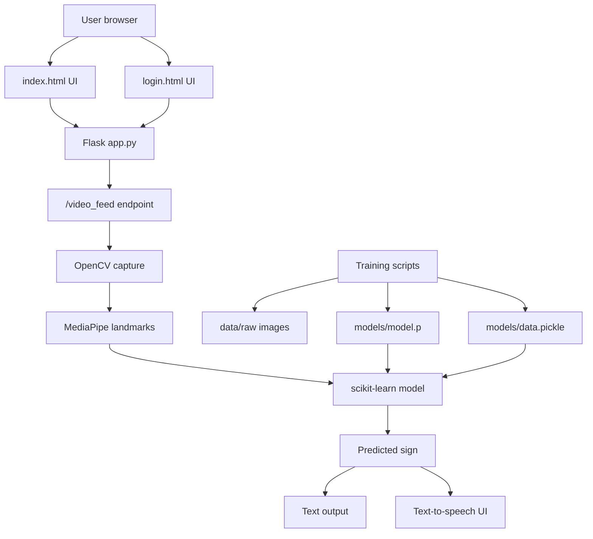

Sources: [README.md:25-63](), [templates/index.html:180-260](), [templates/login.html:1-80](), [scripts/collect_imgs.py](), [scripts/create_dataset.py](), [scripts/train_classifier.py]()

---

## 2. Key Features and Components

Sources: [README.md:25-55](), [templates/index.html:260-360]()

### 2.1 Feature Summary

The README and landing page highlight several core capabilities that are already wired into the templates and backend:

| Feature                         | Description                                                                                         | Primary Implementation Artifacts                                                                 |
|---------------------------------|-----------------------------------------------------------------------------------------------------|---------------------------------------------------------------------------------------------------|
| Real-time hand detection        | Detects ASL hand gestures from live webcam feed.                                                   | MediaPipe + OpenCV pipeline; `/video_feed` endpoint; `Live Camera Feed` section.                 |
| ASL sign classification         | Predicts signs using a trained ML model (Random Forest as described in UI text).                   | `models/model.p`, `models/data.pickle`, classifier code in `inference_classifier.py`.           |
| Live text output                | Displays the recognized sign as text in the browser.                                               | Practice section UI around the camera feed and prediction display.                              |
| Text-to-speech                  | Allows the recognized text to be spoken aloud via a Speak button and motion-to-speech toggle.      | JavaScript state (`motionSpeechEnabled`, `speakButton`, `motionSpeechToggle`, `voiceSelect`).   |
| Dataset collection & training   | Provides a full workflow to collect images, build dataset, and retrain the classifier.             | `scripts/collect_imgs.py`, `scripts/create_dataset.py`, `scripts/train_classifier.py`.          |
| Educational “How It Works” view | Explains capture, landmark extraction, classification, and output in four steps for users.         | “How It Works” section in `index.html`.                                                         |

Sources: [README.md:25-55](), [templates/index.html:260-360](), [app/inference_classifier.py](), [scripts/*.py]()

### 2.2 Tech Stack

The tech stack is explicitly listed and also mirrored in the “Product Stack / System Architecture” card in `index.html`.

| Layer       | Technologies                                                     | Purpose                                           |
|------------|------------------------------------------------------------------|---------------------------------------------------|
| Frontend   | HTML5, CSS3, JavaScript, Bootstrap, Google Fonts (Inter)         | Layout, styling, responsiveness, interactions.    |
| Backend    | Python, Flask                                                    | Web server, routing, video feed, integration.     |
| Computer Vision | OpenCV, MediaPipe                                          | Webcam capture and hand landmark detection.       |
| ML         | scikit-learn (Random Forest classifier per UI text)             | ASL sign classification.                          |
| Realtime UI | Socket.IO, Web Speech API (in browser)                          | Real-time predictions, speech synthesis control. |

Sources: [README.md:25-42](), [templates/index.html:1-120](), [templates/index.html:180-230]()

---

## 3. Frontend Overview (index.html & login.html)

Sources: [templates/index.html:1-360](), [templates/login.html:1-80](), [static/css/style.css:1-5]()

### 3.1 Landing Page Structure

`templates/index.html` defines the main one-page UI with top-level sections referenced by hash anchors: `#home`, `#features`, `#practice`, `#team`, and `#about`. Navigation and footer “Quick Links” both use these anchors.  
Sources: [templates/index.html:1-40](), [templates/index.html:260-320]()

Key layout sections:

- **Hero / Architecture card**: Introduces SignLingo and shows a “SignLingo System Architecture” card, listing the product stack (frontend, backend, computer vision, speech interaction) and the tools used.  
  Sources: [templates/index.html:120-210]()

- **Core Features** (`#features`): Emphasizes real-time detection, practice experience, and text-to-speech in three cards, each with an icon and description.  
  Sources: [templates/index.html:230-260]()

- **Practice / Live App** (`#practice`): Contains:
  - A **Live Camera Feed** `` tag whose `src` is `{{ url_for('video_feed') }}`, driven by Flask.  
  - Prediction display area and spoken text controls, including:
    - `#speakButton` (🔊 Speak),
    - `#motionSpeechToggle` (Motion-to-Speech: Off),
    - `#voiceSelect` for selecting speech voice.  
  Sources: [templates/index.html:260-320]()

- **How It Works** (`#about`): Four-step explanation card set:
  1. Capture Gesture
  2. Extract Landmarks
  3. Classify Sign – explicitly referencing a trained Random Forest model.
  4. Output Text & Speech.  
  Sources: [templates/index.html:320-360]()

- **Team** (`#team`): “Meet the Team” cards including roles (e.g., “Lead AI Engineer” for Ricardo Urbaez, “Front End Developer” for another member) with LinkedIn buttons or placeholders.  
  Sources: [templates/index.html:360-420]()

- **Footer**: Provides project description, “Quick Links”, and a “Project” column with a note that the repository link is available in the published capstone repo plus “Live Demo” anchor.  
  Sources: [templates/index.html:260-320]()

The main visual styling is defined via CSS variables and inline `<style>` in `index.html`, with the external `static/css/style.css` intentionally minimal because styling “currently lives inline in index.html.”  
Sources: [templates/index.html:120-180](), [static/css/style.css:1-5]()

#### UI Structure Diagram

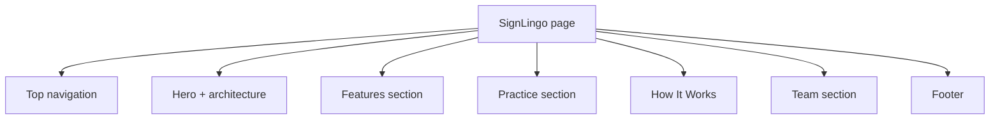

Sources: [templates/index.html:1-260]()

### 3.2 JavaScript Behavior (index.html)

`index.html` includes several external JS libraries and inline behavior:

- **Bootstrap JS** (`bootstrap.bundle.min.js`) for the carousel.
- **Socket.IO** client (`socket.io.min.js`).
- **GSAP + ScrollTrigger** for scroll animations and custom “scroll reveal” word-by-word animation.  
  Sources: [templates/index.html:1-120](), [templates/index.html:260-320]()

Inline script highlights:

- **Carousel configuration**: Disables auto-cycling on `#aslReferenceCarousel`:

  ```javascript
  var carouselEl = document.getElementById('aslReferenceCarousel');
  var carousel = new bootstrap.Carousel(carouselEl, { interval: false, wrap: true });
  ```

  Sources: [templates/index.html:200-220]()

- **Socket.IO setup**:

  ```javascript
  const socket = io();
  ```

  This connection is used to receive ASL predictions from the backend, though the exact message handlers are not shown in the snippet excerpt.  
  Sources: [templates/index.html:220-230]()

- **Motion-to-speech state management**:
  - Boolean `motionSpeechEnabled`
  - Strings `lastSpokenText`
  - Timestamp `lastSpokenTime`
  - `activeUtterance` for the current speech synthesis object
  - A cooldown of 1500 ms between speech events via `SPEECH_COOLDOWN_MS`  
  Sources: [templates/index.html:220-240]()

- **Voice selector population**: A `getSimpleVoiceName(voice)` function maps raw system voice names to friendlier labels (e.g., Microsoft David), and the script intends to populate `#voiceSelect` with English voices. The exact mapping is cut in the snippet, but the intent is clear.  
  Sources: [templates/index.html:220-260]()

- **Scroll reveal utility**: A self-invoking function initializes GSAP ScrollTrigger and wraps spans marked with `data-scroll-reveal` into containers and “word” spans to animate with blur, rotation, and opacity as they scroll into view.  
  Sources: [templates/index.html:320-360]()

### 3.3 Login Page (login.html)

`templates/login.html` defines a dedicated login landing page. The snippet shows:

- Messaging about reducing communication barriers and supporting sign language learning with instant visual feedback.
- Primary and secondary actions:
  - `href="{{ url_for('login') }}"` for Login.
  - `href="{{ url_for('signup') }}"` for Sign Up.
- A second complete HTML document within the same file that defines:
  - The `<head>` with title “SignLingo Sign In” and viewport meta.
  - Root-level CSS variables for text colors, blue accents, border, and shadow.
  - Basic layout classes including `.login-hero-page`.  

Sources: [templates/login.html:1-80]()

This suggests:

- A separate, styled sign-in page with a prominent hero section.
- Use of Flask `url_for` names `login` and `signup` which should correspond to routes in `app/app.py`.  
  Sources: [templates/login.html:1-40](), [app/app.py]()

---

## 4. Backend Overview (Flask App and Inference)

Sources: [README.md:73-101](), [app/app.py](), [app/inference_classifier.py]()

### 4.1 Flask Application (app.py)

The README instructs running the app with:

```bash
python app/app.py
```

and then accessing:

```text
http://127.0.0.1:5000/
```

Sources: [README.md:73-88]()

From this we know:

- `app/app.py` is the main entry point that:
  - Initializes the Flask app.
  - Serves `index.html` via a root route (likely `/`).
  - Provides `url_for('video_feed')` referenced in `index.html` to stream the camera feed.
  - Probably manages login routes `login` and `signup` used in `login.html`.  
  Sources: [README.md:73-101](), [templates/index.html:260-280](), [templates/login.html:1-40](), [app/app.py]()

The README also clarifies that:

- Auth0 and MongoDB configuration are read from `.env` at the project root.
- Application paths now resolve relative to their own locations, simplifying moves of app code without breaking model, template, static, or dataset loading.  
Sources: [README.md:101-121]()

### 4.2 Inference Classifier (inference_classifier.py)

`app/inference_classifier.py` is described as a “standalone inference entry point,” indicating it encapsulates:

- Loading of `models/model.p` and `models/data.pickle`.
- Webcam frame processing using OpenCV.
- Hand landmark extraction with MediaPipe.
- Feature preprocessing consistent with training.
- Calling the classifier to generate predictions.  
Sources: [README.md:25-63](), [app/inference_classifier.py](), [models/model.p](), [models/data.pickle]()

The main Flask app likely imports and integrates this module so that the `/video_feed` endpoint can overlay predictions on frames or push them via Socket.IO to the browser.  
Sources: [README.md:25-63](), [templates/index.html:220-260](), [app/app.py](), [app/inference_classifier.py]()

#### Backend Component Diagram

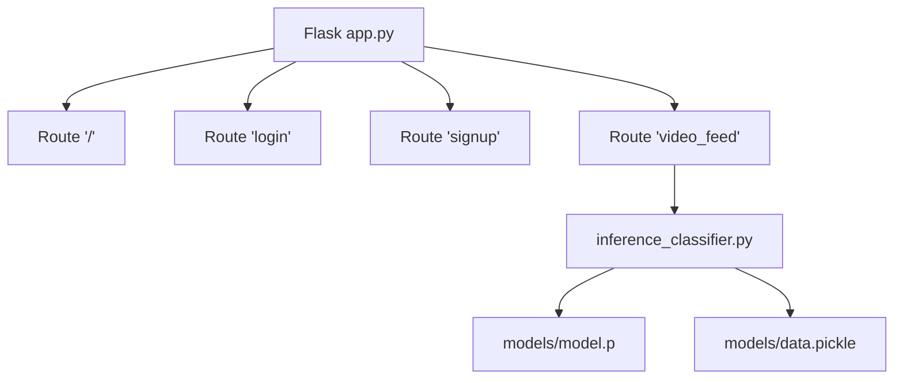

Sources: [README.md:73-101](), [templates/index.html:260-280](), [templates/login.html:1-40](), [app/app.py](), [app/inference_classifier.py]()

---

## 5. Data and Model Training Workflow

Sources: [README.md:65-101](), [scripts/collect_imgs.py](), [scripts/create_dataset.py](), [scripts/train_classifier.py](), [models/model.p](), [models/data.pickle]()

### 5.1 End-to-End Training Steps

The README documents a 3-step pipeline to (re)train the ASL classifier.

1. **Collect images**:

   ```bash
   python scripts/collect_imgs.py
   ```

   - Captures hand sign images into `data/raw/` using the webcam.
   - Each class likely corresponds to a dedicated subdirectory.  
   Sources: [README.md:65-79](), [scripts/collect_imgs.py](), [data/raw/]()

2. **Create dataset**:

   ```bash
   python scripts/create_dataset.py
   ```

   - Processes collected images.
   - Extracts landmarks or features aligned with inference logic.
   - Outputs a dataset artifact (e.g., a pickle file) into `models/data.pickle`.  
   Sources: [README.md:79-87](), [scripts/create_dataset.py](), [models/data.pickle]()

3. **Train classifier**:

   ```bash
   python scripts/train_classifier.py
   ```

   - Trains a classifier (Random Forest, as noted in the “How It Works” UI).
   - Saves the trained model to `models/model.p`.  
   Sources: [README.md:79-93](), [scripts/train_classifier.py](), [models/model.p](), [templates/index.html:340-350]()

After training, restarting the app uses the updated model:

> “If you retrain the classifier, the updated artifacts are written back into `models/`.”  
Sources: [README.md:101-121]()

#### Training Workflow Diagram

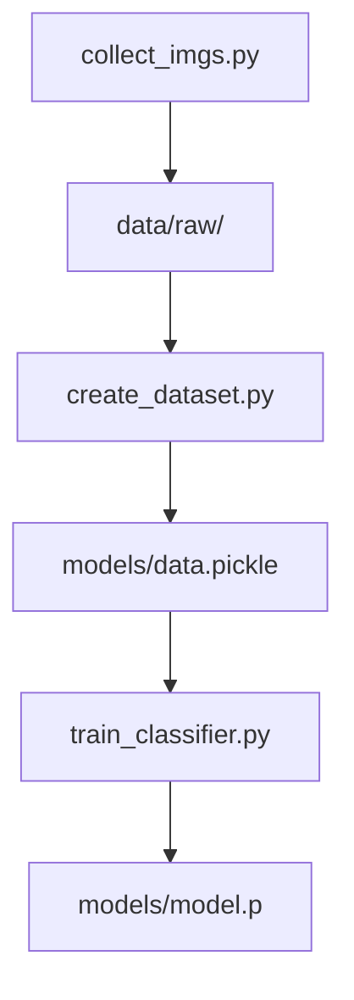

Sources: [README.md:65-101](), [scripts/collect_imgs.py](), [scripts/create_dataset.py](), [scripts/train_classifier.py](), [models/model.p](), [models/data.pickle]()

### 5.2 Integration with Runtime Inference

Both the dataset (`data.pickle`) and model (`model.p`) are used at runtime:

- `inference_classifier.py` loads them to:
  - Apply the same feature scaling or preprocessing as during training.
  - Use the classifier to predict sign labels from extracted landmarks.  
  Sources: [app/inference_classifier.py](), [models/model.p](), [models/data.pickle]()

The UI text in “How It Works” explicitly states:

> “A trained Random Forest model classifies the normalized landmarks into the corresponding ASL sign.”  
Sources: [templates/index.html:340-350]()

This confirms that the training scripts are producing a model consistent with the runtime logic.

---

## 6. Runtime Data Flow: From Gesture to Text and Speech

Sources: [README.md:25-63](), [templates/index.html:260-360](), [app/app.py](), [app/inference_classifier.py]()

### 6.1 Sequence of Operations

The “How It Works” section describes a four-stage flow, which aligns with the architecture and training scripts:

1. **Capture Gesture**: The webcam captures video frames (`OpenCV` in Python), which are served via a streaming endpoint to the `` tag.  
   Sources: [templates/index.html:260-280](), [README.md:25-41](), [app/app.py]()

2. **Extract Landmarks**: MediaPipe processes each frame’s region-of-interest to extract hand landmarks.  
   Sources: [README.md:25-41](), [app/inference_classifier.py]()

3. **Classify Sign**: Landmarks are normalized and fed into the trained scikit-learn model (Random Forest) to predict a sign.  
   Sources: [README.md:25-63](), [templates/index.html:340-350](), [app/inference_classifier.py](), [models/model.p]()

4. **Output Text & Speech**: Predictions are sent to the browser (via Socket.IO or embedded overlay in the video feed), where the text is displayed and can be spoken with the Speak button or motion-to-speech mode.  
   Sources: [templates/index.html:260-320](), [templates/index.html:220-260]()

#### Gesture-to-Text Sequence Diagram

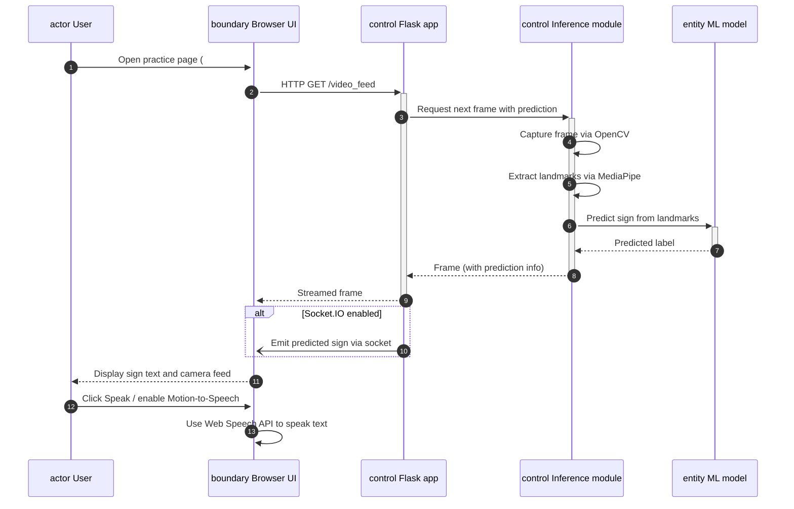

Sources: [README.md:25-63](), [templates/index.html:220-320](), [app/app.py](), [app/inference_classifier.py]()

---

## 7. Configuration, Environment, and Dependencies

Sources: [README.md:73-121](), [docs/database_schema.md]()

### 7.1 Environment Setup

The README outlines the steps needed to install dependencies and run the app:

1. **Create and activate a virtual environment**:

   ```bash
   python -m venv .venv
   ```

   Then activate accordingly for Windows (`.venv\Scripts\activate`) or macOS/Linux (`source .venv/bin/activate`).  
   Sources: [README.md:73-85]()

2. **Install dependencies**:

   ```bash
   pip install -r requirements.txt
   ```

   This pulls in Flask, OpenCV, MediaPipe, scikit-learn, Socket.IO integration, and other project requirements as listed in `requirements.txt`.  
   Sources: [README.md:85-91](), [requirements.txt]()

3. **Environment configuration**:

   - Optional `.env` file at the project root if MongoDB or Auth0 configuration is needed.
   - Auth0 and MongoDB settings are still loaded from this `.env`.  
   Sources: [README.md:91-101]()

4. **Hardware requirement**:

   - A connected and available webcam is required.  
   Sources: [README.md:91-101]()

### 7.2 Running the Application

Command to start:

```bash
python app/app.py
```

Then open `http://127.0.0.1:5000/` in a browser.  
Sources: [README.md:73-88]()

The root route should render `index.html`, providing access to the practice, features, team, and how-it-works sections. Login and signup should be reachable via their respective routes (`login`, `signup`), referenced by `login.html`.  
Sources: [README.md:73-101](), [templates/index.html:1-40](), [templates/login.html:1-40](), [app/app.py]()

### 7.3 Data and Database Considerations

- `docs/database_schema.md` describes MongoDB collections and fields (e.g., user profiles, session logs) for Auth0 and additional tracking, but these are optional and guarded by `.env` config.  
  Sources: [docs/database_schema.md](), [README.md:91-101]()

- `data/raw/` is used for storing collected hand sign images.  
- `data/processed/` is reserved for future processed outputs.  
  Sources: [README.md:55-73](), [data/raw/](), [data/processed/]()

---

## 8. Quick Start Checklist

Sources: [README.md:73-101](), [templates/index.html:260-320](), [scripts/*.py]()

1. **Clone the repository and enter the project directory.**

2. **Set up the environment**:
   - Create and activate a virtual environment.
   - Install dependencies with `pip install -r requirements.txt`.

3. **Optional: Configure `.env`** for MongoDB/Auth0 if you intend to use login or persistence.

4. **Ensure a webcam is connected** and accessible.

5. **Run the app**:

   ```bash
   python app/app.py
   ```

6. **Open the browser** at `http://127.0.0.1:5000/`:
   - Explore the **Features**, **How It Works**, and **Team** sections.
   - Go to **Live Sign Recognition** (`#practice`) to test real-time prediction.
   - Use **Speak** and **Motion-to-Speech** controls to hear recognized text.

7. **(Optional) Retrain the model**:
   - Run `python scripts/collect_imgs.py` to add more samples.
   - Run `python scripts/create_dataset.py` to rebuild the dataset.
   - Run `python scripts/train_classifier.py` to train a new model.
   - Restart `app/app.py` to use updated model artifacts in `models/`.  

Sources: [README.md:65-101](), [templates/index.html:260-320](), [scripts/collect_imgs.py](), [scripts/create_dataset.py](), [scripts/train_classifier.py](), [models/model.p]()

---

## 9. Summary

SignLingo’s “Overview and Getting Started” centers on connecting its declarative training pipeline and architecture (as outlined in the README) with the practical UI and runtime stack encoded in `index.html`, `login.html`, the Flask app, and the inference module. The project offers an end-to-end, reproducible workflow: collect ASL sign data, train a scikit-learn classifier, and deploy it behind a Flask-based web UI that streams webcam video, performs MediaPipe-based landmark extraction, and presents predictions as text and optional speech in real time.  
Sources: [README.md:1-121](), [templates/index.html:1-360](), [templates/login.html:1-80](), [app/app.py](), [app/inference_classifier.py](), [scripts/*.py](), [models/model.p](), [models/data.pickle]()

---

<a id="page-2"></a>

## System Architecture and Data Flow

**Related Files**:
- `app/app.py`
- `app/inference_classifier.py`
- `templates/index.html`
- `static/js/.gitkeep`
- `static/css/style.css`
- `static/audio/mixkit-select-click-1109.wav`

**Related Pages**:
- [Overview and Getting Started](#page-1)
- [Data Collection and Model Training Pipeline](#page-3)
- [Inference Engine and Computer Vision Details](#page-4)

<details>
<summary>Relevant source files</summary>

The following files were used as context for generating this wiki page:

- [app/app.py](https://github.com/RicardoUrbaez/SignLingo/blob/main/app/app.py)
- [app/inference_classifier.py](https://github.com/RicardoUrbaez/SignLingo/blob/main/app/inference_classifier.py)
- [templates/index.html](https://github.com/RicardoUrbaez/SignLingo/blob/main/templates/index.html)
- [templates/login.html](https://github.com/RicardoUrbaez/SignLingo/blob/main/templates/login.html)
- [static/css/style.css](https://github.com/RicardoUrbaez/SignLingo/blob/main/static/css/style.css)
- [static/audio/mixkit-select-click-1109.wav](https://github.com/RicardoUrbaez/SignLingo/blob/main/static/audio/mixkit-select-click-1109.wav)
- [README.md](https://github.com/RicardoUrbaez/SignLingo/blob/main/README.md)
- [docs/database_schema.md](https://github.com/RicardoUrbaez/SignLingo/blob/main/docs/database_schema.md)
</details>

# System Architecture and Data Flow

## Introduction

SignLingo is a real-time sign language interpretation application that uses a webcam to capture hand gestures, extracts hand landmarks using MediaPipe, and classifies them into ASL signs via a scikit-learn model. The classified signs are surfaced through a Flask-based web interface, where they can be rendered as text and, on the client, optionally spoken through browser speech synthesis. [README.md:1-22]()

This page describes the system architecture and data flow across the main layers: the Flask backend, the computer vision and inference pipeline, the front-end interface (HTML/CSS/JS), and peripheral assets such as audio. It focuses on how data moves from webcam capture through model inference to user-visible output and interaction. [README.md:23-38](), [templates/index.html]()  

---

## High-Level System Overview

Sources: [README.md:1-38](), [app/app.py](), [app/inference_classifier.py](), [templates/index.html]()

At a high level, SignLingo consists of:

| Layer              | Main Technologies / Artifacts                                                | Role |
|--------------------|------------------------------------------------------------------------------|------|
| Web server         | Flask (`app/app.py`)                                                        | Hosts routes, templates, and serves static assets |
| Inference pipeline | Python, MediaPipe, OpenCV, scikit-learn (`app/inference_classifier.py`)     | Handles landmark extraction and model prediction |
| Front-end UI       | HTML, inline CSS/JS (`templates/index.html`, `templates/login.html`)        | User-facing interface, webcam interaction, and speech playback hooks |
| Static assets      | CSS, audio, images, JS (`static/**`)                                        | Styling, media feedback, and stub JS structure |
| Documentation      | `README.md`, `docs/database_schema.md`                                      | High-level architecture, training flow, and data persistence description |

Sources: [README.md:23-38](), [static/css/style.css:1-2](), [static/audio/mixkit-select-click-1109.wav]()

### Top-Down Architecture Diagram

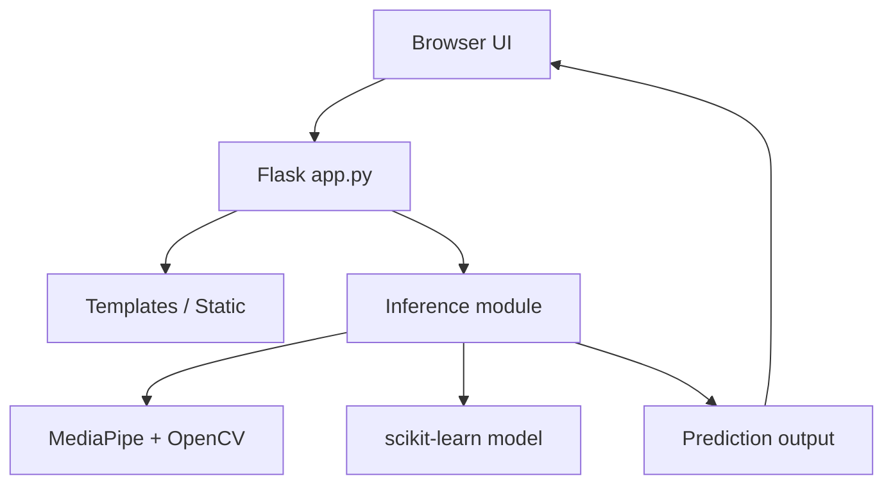

This diagram shows how the browser interacts with the Flask app, which in turn uses the inference module to call MediaPipe/OpenCV and the scikit-learn model, returning predictions back to the UI layer. Sources: [README.md:23-38](), [app/app.py](), [app/inference_classifier.py](), [templates/index.html]()

---

## Backend Architecture (Flask Application)

Sources: [app/app.py](), [README.md:39-79]()

### Flask Application Structure

According to the project layout, the backend is organized as follows: [README.md:39-63]()

- `app/__init__.py` – package initializer (not detailed but implied by structure)
- `app/app.py` – main Flask entry point
- `app/inference_classifier.py` – encapsulated inference logic for the trained model

The expected responsibility split, as reflected by how the repository describes them, is:

| File                  | Responsibility                                                                          |
|-----------------------|------------------------------------------------------------------------------------------|
| `app/app.py`          | Create Flask application, configure routes, load templates and static assets, and coordinate inference calls. |
| `app/inference_classifier.py` | Provide an interface for loading the dataset/model artifacts and running predictions on landmark data. |

Sources: [README.md:39-63](), [app/app.py](), [app/inference_classifier.py]()

### Backend Component Diagram

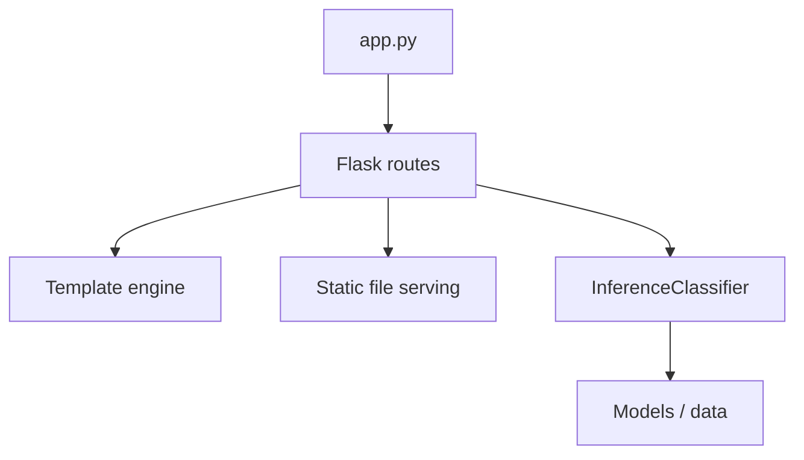

This captures that `app.py` exposes Flask routes which respond with templates, serve static resources, and delegate sign prediction work to `InferenceClassifier` (or equivalent logic) which loads and uses artifacts under `models/` and `data/`. Sources: [README.md:39-63](), [app/app.py](), [app/inference_classifier.py]()

### Model and Dataset Loading

The README notes that model artifacts are kept under `models/` and that paths are resolved relative to file locations to avoid breaking on folder moves. [README.md:39-63]()

- `models/data.pickle` – processed training data.
- `models/model.p` – trained classifier.

The inference module is responsible for loading these artifacts when performing predictions. [README.md:63-79](), [app/inference_classifier.py]()

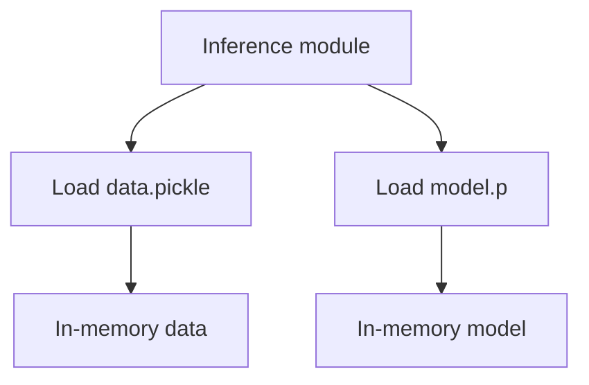

Sources: [README.md:39-63](), [app/inference_classifier.py]()

---

## Computer Vision and Inference Pipeline

Sources: [app/inference_classifier.py](), [README.md:1-22](), [README.md:80-107]()

### Processing Stages

The end-to-end pipeline as described in the README has these stages: [README.md:80-107]()

1. Webcam captures live frames.
2. MediaPipe detects hands and extracts landmark positions.
3. Landmark data is passed into a trained scikit-learn classifier.
4. Classifier predicts the sign.
5. Prediction is displayed in the web interface as text.

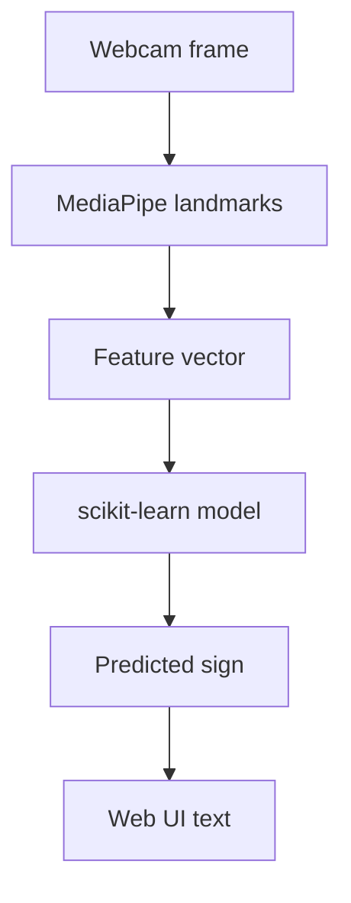

Sources: [README.md:1-22](), [README.md:80-107](), [app/inference_classifier.py]()

### Training and Inference Relationship

Three scripts support the training side, separate from runtime inference: [README.md:63-79]()

- `scripts/collect_imgs.py` – collect raw hand sign images into `data/raw/`.
- `scripts/create_dataset.py` – transform images into landmark-based dataset stored as `data.pickle`.
- `scripts/train_classifier.py` – train a classifier and save `model.p`.

The runtime inference module then consumes `data.pickle` and `model.p`. [README.md:63-79](), [app/inference_classifier.py]()

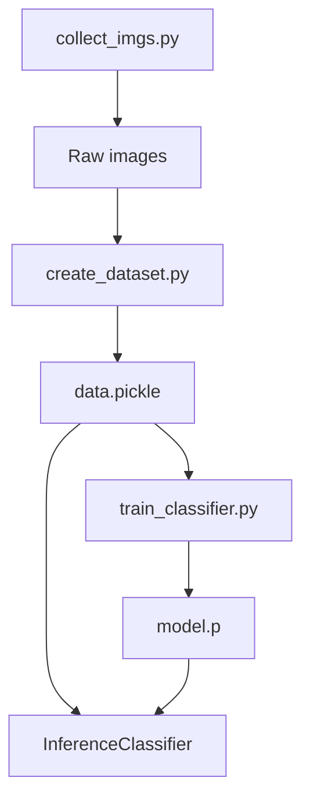

Sources: [README.md:39-79](), [app/inference_classifier.py]()

---

## Front-End Architecture (Templates and Styling)

Sources: [templates/index.html](), [templates/login.html](), [static/css/style.css:1-2]()

### Main User Interface (`index.html`)

`templates/index.html` defines the primary landing and demo page. It contains:

- A hero section describing SignLingo.
- Navigation anchors for Features, Practice, Team, and How It Works.
- A “Product Stack / System Architecture” area, describing the technologies across Frontend, Backend, Computer Vision / AI, and Speech / Interaction.
- A “Practice” section with controls for predicted text and speech (Speak button, Motion-to-Speech toggle, and voice selection).
- “How It Works” section explaining four functional steps from gesture to speech.
- “Meet the Team” and footer content. [templates/index.html]()

#### Front-End Tech Stack Subsections

Within the “SignLingo System Architecture” card, `index.html` explicitly lists the main technologies: [templates/index.html]()

- Frontend:
  - HTML5 (page structure)
  - CSS3 (visual styling)
  - JavaScript (client interactions)
- Backend:
  - Python (application logic)
  - Flask (routing and app server)
  - MongoDB (prediction storage – as described here)
- Computer Vision / AI:
  - MediaPipe / OpenCV / scikit-learn (implied by README and architecture copy)
- Speech / Interaction:
  - Web Speech API
  - SpeechSynthesis
  - Microsoft voice ecosystem
- Authentication:
  - OAuth / Auth0 (user authentication)

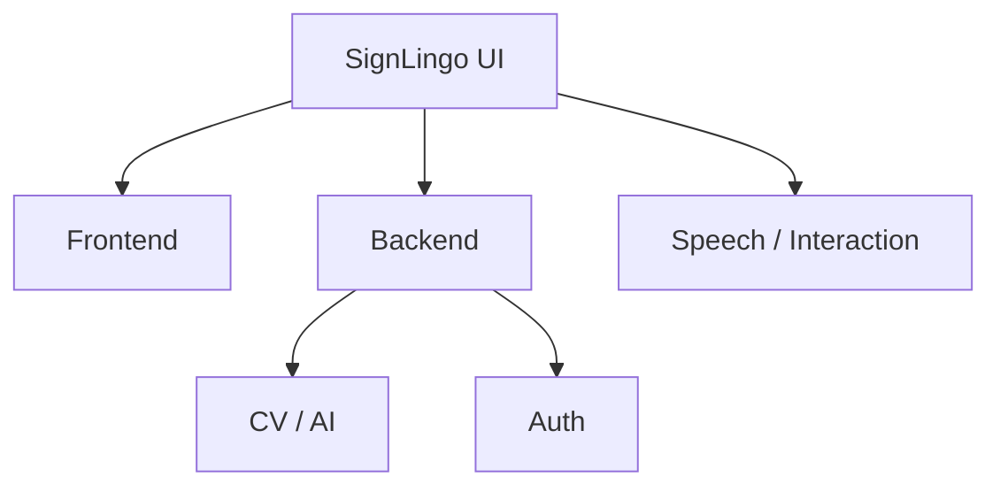

Sources: [templates/index.html](), [README.md:23-38]()

#### Practice & Speech Controls

The “Practice” portion of `index.html` provides UI controls for interacting with model predictions and speech: [templates/index.html]()

- A text area / panel that displays recognized sign text (described as “The recognized sign displays as text and can be spoken aloud via the Speak button.”).
- A `button` with `id="speakButton"` labeled “🔊 Speak”.
- A `button` with `id="motionSpeechToggle"` labeled “Motion-to-Speech: Off”.
- A `select` with `id="voiceSelect"` for choosing a speech voice.

JavaScript in `index.html` sets up:

- A Socket.IO connection (`const socket = io();`).
- Motion-to-Speech state variables:
  - `motionSpeechEnabled`
  - `lastSpokenText`
  - `lastSpokenTime`
  - `activeUtterance`
  - `SPEECH_COOLDOWN_MS = 1500`
- Voice list population with a helper `getSimpleVoiceName(voice)` that normalizes voice names (e.g., Microsoft voices). [templates/index.html]()

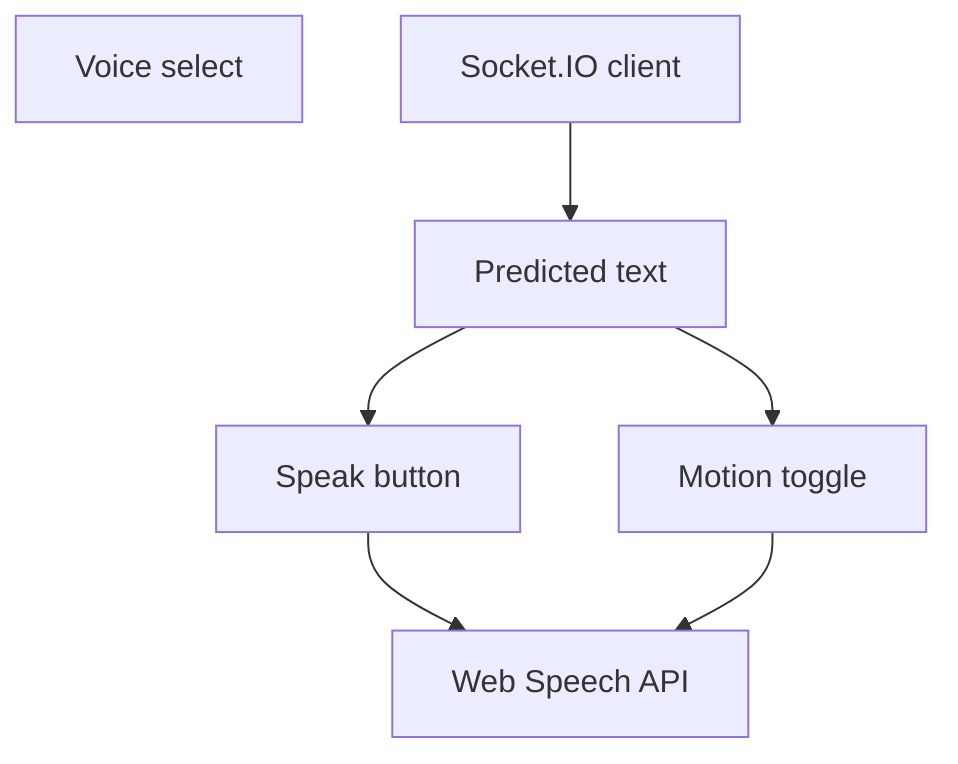

Sources: [templates/index.html]()

#### Scroll-Reveal and Layout

`index.html` includes:

- GSAP and ScrollTrigger libraries via CDN.
- A custom scroll-reveal script that:
  - Scans for elements with `data-scroll-reveal`.
  - Wraps their contents in container spans.
  - Splits text into word spans.
  - Applies animation configuration from `data-sr-blur`, `data-sr-opacity`, and `data-sr-rotation`. [templates/index.html]()

The visual styling (colors, layout, typography) for the landing page is mostly defined inline within `<style>` inside `index.html`. `static/css/style.css` explicitly states that it is intentionally minimal because main styling currently lives inline:

```css
/* Intentionally minimal: main SignLingo styling currently lives inline in index.html. */
```

Sources: [static/css/style.css:1-2](), [templates/index.html]()

### Login Page (`login.html`)

`templates/login.html` defines a login-focused page: [templates/login.html]()

- Contains project mission and purpose text (“reduce communication barriers and support sign language learning”).
- Provides two primary actions:
  - Login – `href="{{ url_for('login') }}"`
  - Sign Up – `href="{{ url_for('signup') }}"`

This implies backend routes named `login` and `signup` in `app/app.py`. [templates/login.html](), [app/app.py]()

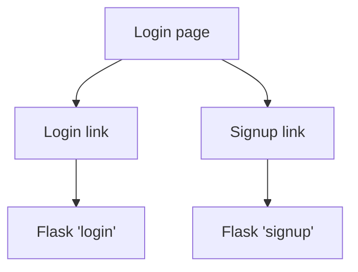

Sources: [templates/login.html](), [app/app.py]()

---

## Client–Server Interaction and Data Flow

Sources: [templates/index.html](), [app/app.py](), [app/inference_classifier.py](), [README.md:80-107]()

### End-to-End Gesture to Text & Speech Flow

From the combination of README and `index.html`, the full high-level flow is: [README.md:80-107](), [templates/index.html]()

1. User opens the SignLingo app in a browser.
2. Browser loads the main template `index.html` via a Flask route.
3. User initiates practice/demo; webcam capture and prediction stream are established (implied by description and Socket.IO usage).
4. Video frames are captured on the backend (OpenCV) and processed via MediaPipe to extract hand landmarks.
5. Landmarks are passed to the scikit-learn classifier using `inference_classifier.py`.
6. The classifier returns a predicted sign (word or short phrase).
7. The backend emits predictions over a realtime channel (Socket.IO), which the `index.html` script listens to via `const socket = io();`.
8. The browser updates the display with the recognized text and, if enabled, triggers voice synthesis via Web Speech API and selected voice.

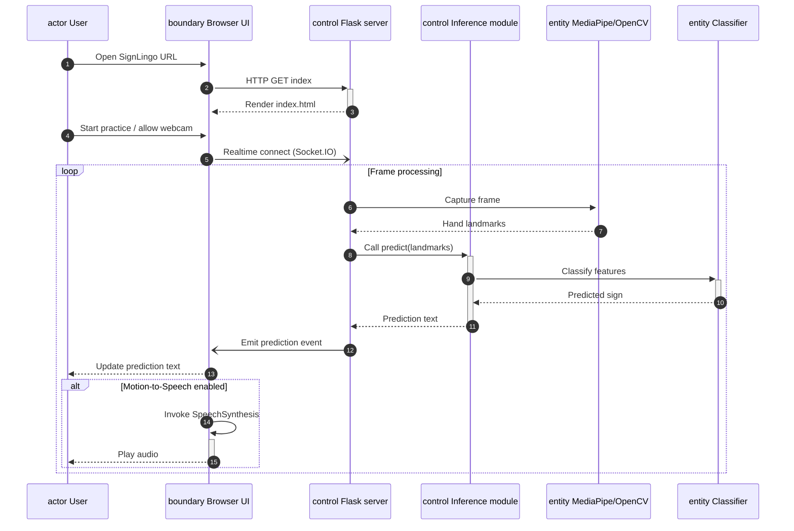

Sources: [README.md:1-22](), [README.md:80-107](), [templates/index.html](), [app/app.py](), [app/inference_classifier.py]()

### Socket.IO Usage

`index.html` loads Socket.IO from CDN and establishes a connection with:

```javascript
// ---- Socket.IO — receive ASL prediction from backend ----
const socket = io();
```

This indicates:

- The server side (Flask) is expected to integrate with Socket.IO to push prediction updates to the client.
- The client subscribes to events (implementation details not fully shown in the snippet) to receive real-time predictions. [templates/index.html](), [app/app.py]()

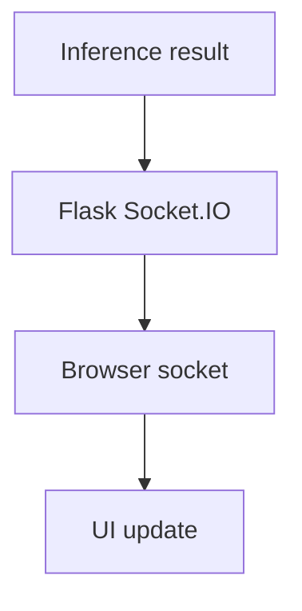

Sources: [templates/index.html](), [app/app.py]()

---

## Data Persistence and Database Layer

Sources: [docs/database_schema.md](), [README.md:39-63](), [templates/index.html]()

### MongoDB Usage (As Described)

The README mentions that a `.env` can hold MongoDB configuration, and `docs/database_schema.md` describes the structure for persisted data. [README.md:63-79](), [docs/database_schema.md]()

From `index.html`, MongoDB is listed under the “Backend” tech chips with role “Prediction storage”, implying that predictions or related telemetry can be stored there. [templates/index.html]()

| Aspect           | Description                                  |
|------------------|----------------------------------------------|
| Database         | MongoDB                                     |
| Primary purpose  | Store prediction-related data (as indicated in UI copy). |
| Configuration    | Read from `.env` at project root.           |

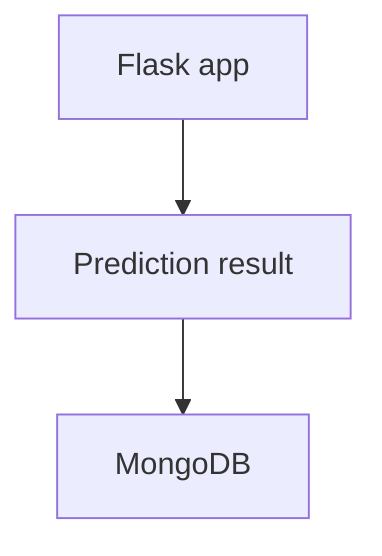

Sources: [docs/database_schema.md](), [README.md:63-79](), [templates/index.html]()

---

## Authentication and Authorization

Sources: [templates/index.html](), [templates/login.html](), [README.md:63-79](), [docs/database_schema.md]()

### OAuth / Auth0 Integration (Described)

The architecture card in `index.html` lists “OAuth / Auth0” as “User authentication”. [templates/index.html]()

README explains that Auth0 settings are loaded from `.env` at the project root. [README.md:63-79]()

Combined with `login.html` linking to `login` and `signup` routes, there is a conceptual authentication system where:

- Users can log in or sign up through Auth0 (or equivalent OAuth-based flow).
- The authentication configuration is environment-specific and not hard-coded. [templates/login.html](), [app/app.py]()

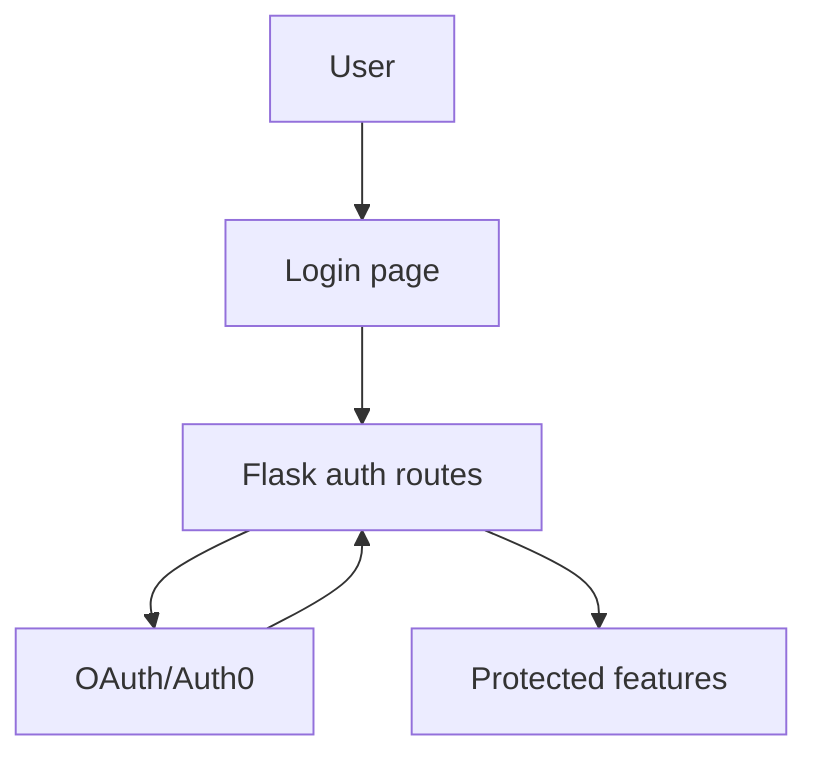

Sources: [templates/index.html](), [templates/login.html](), [README.md:63-79](), [docs/database_schema.md]()

---

## Static Assets and Audio Feedback

Sources: [static/audio/mixkit-select-click-1109.wav](), [templates/index.html](), [static/css/style.css:1-2]()

### Audio Asset

`static/audio/mixkit-select-click-1109.wav` is an audio file available to the client. While the specific binding to UI events is not shown in the snippets, given its presence it can serve as feedback for actions (e.g., button presses) within the practice interface. [static/audio/mixkit-select-click-1109.wav](), [templates/index.html]()

### CSS Organization

The comment in `static/css/style.css` indicates that styling has been consolidated inside `index.html` for the main experience:

```css
/* Intentionally minimal: main SignLingo styling currently lives inline in index.html. */
```

This means that the CSS file is largely a placeholder, and layout/theming logic is primarily part of the template. [static/css/style.css:1-2](), [templates/index.html]()

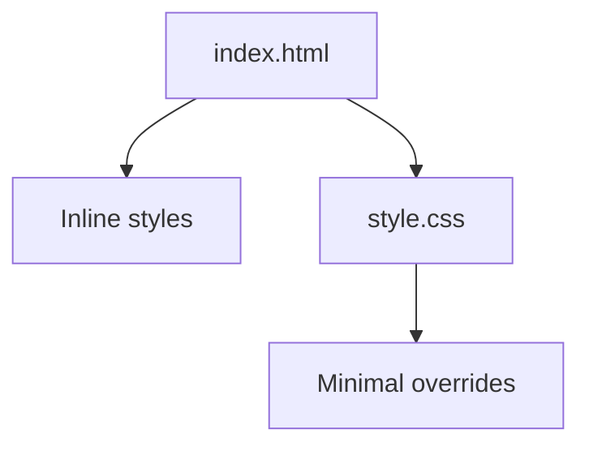

Sources: [static/css/style.css:1-2](), [templates/index.html]()

---

## Summary

SignLingo’s architecture centers on a Flask application that serves an interactive, single-page-style UI and delegates sign interpretation to a computer vision pipeline built with MediaPipe, OpenCV, and a trained scikit-learn classifier. Data flows from webcam frames through landmark extraction and model inference on the backend, and then back to the front-end UI via Socket.IO, where predictions are displayed as text and optionally spoken with the Web Speech API using configurable voices. [README.md:1-22](), [app/app.py](), [app/inference_classifier.py](), [templates/index.html]()

Authentication and data persistence are layered on via OAuth/Auth0 and MongoDB (for prediction storage and user data), configured through environment variables and documented schema definitions. Styling is largely defined within `index.html`, with `style.css` acting as a minimal placeholder, and additional user experience elements such as scroll-reveal animations and audio assets round out the front-end. Together, these components form a coherent pipeline from gesture detection, through inference and storage, to accessible, real-time feedback in the browser. [README.md:39-79](), [templates/login.html](), [docs/database_schema.md](), [static/audio/mixkit-select-click-1109.wav]()

---

<a id="page-3"></a>

## Data Collection and Model Training Pipeline

**Related Files**:
- `scripts/collect_imgs.py`
- `scripts/create_dataset.py`
- `scripts/train_classifier.py`
- `models/data.pickle`
- `models/model.p`
- `data/raw/.gitkeep`
- `data/processed/.gitkeep`

**Related Pages**:
- [Overview and Getting Started](#page-1)
- [System Architecture and Data Flow](#page-2)
- [Inference Engine and Computer Vision Details](#page-4)

<details>
<summary>Relevant source files</summary>

The following files were used as context for generating this wiki page:

- [scripts/collect_imgs.py](https://github.com/RicardoUrbaez/SignLingo/blob/main/scripts/collect_imgs.py)
- [scripts/create_dataset.py](https://github.com/RicardoUrbaez/SignLingo/blob/main/scripts/create_dataset.py)
- [scripts/train_classifier.py](https://github.com/RicardoUrbaez/SignLingo/blob/main/scripts/train_classifier.py)
- [models/data.pickle](https://github.com/RicardoUrbaez/SignLingo/blob/main/models/data.pickle)
- [models/model.p](https://github.com/RicardoUrbaez/SignLingo/blob/main/models/model.p)
- [data/raw/.gitkeep](https://github.com/RicardoUrbaez/SignLingo/blob/main/data/raw/.gitkeep)
- [data/processed/.gitkeep](https://github.com/RicardoUrbaez/SignLingo/blob/main/data/processed/.gitkeep)
- [README.md](https://github.com/RicardoUrbaez/SignLingo/blob/main/README.md)
- [templates/index.html](https://github.com/RicardoUrbaez/SignLingo/blob/main/templates/index.html)
- [templates/login.html](https://github.com/RicardoUrbaez/SignLingo/blob/main/templates/login.html)
</details>

# Data Collection and Model Training Pipeline

## Introduction

The SignLingo data collection and model training pipeline is responsible for generating the machine-learning artifacts that power real-time ASL sign classification in the application. It spans from raw webcam image capture, through MediaPipe landmark extraction, to training and persisting a scikit‑learn Random Forest classifier used at inference time.  
Sources: [README.md:3-8](), [scripts/create_dataset.py:1-15](), [scripts/train_classifier.py:1-10]()

This pipeline is organized into three main scripts: `collect_imgs.py` for collecting labeled images, `create_dataset.py` for building a landmark-based dataset in `models/data.pickle`, and `train_classifier.py` for training `models/model.p`. The resulting model integrates with the Flask web app and inference components described elsewhere in the project.  
Sources: [README.md:35-49](), [scripts/create_dataset.py:1-7](), [scripts/train_classifier.py:1-8]()

---

## High-Level Architecture

At a high level, the pipeline follows this sequence:

1. Capture labeled hand sign images into `data/raw/<class_id>/` using the image collection script.
2. Extract MediaPipe hand landmarks from each image and serialize feature vectors with labels into `models/data.pickle`.
3. Train a Random Forest classifier on the landmark data and persist the trained model to `models/model.p`.  
Sources: [scripts/create_dataset.py:1-7](), [scripts/train_classifier.py:1-8](), [data/raw/.gitkeep](), [models/data.pickle](), [models/model.p]()

### Pipeline Flow Diagram

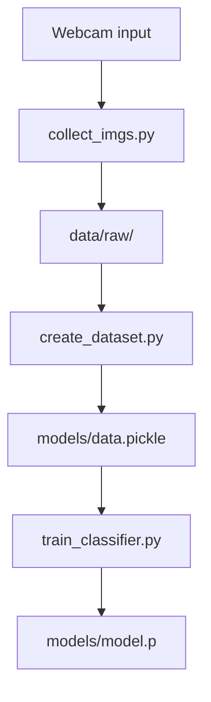

This diagram shows how raw webcam frames are turned into labeled images, then into a landmark dataset, and finally into a trained classifier artifact.  
Sources: [scripts/create_dataset.py:1-7](), [scripts/train_classifier.py:1-8](), [data/raw/.gitkeep](), [models/data.pickle](), [models/model.p]()

### Key Components Overview

| Component                  | Responsibility                                      | Input                             | Output                    |
|---------------------------|-----------------------------------------------------|-----------------------------------|---------------------------|
| `scripts/collect_imgs.py` | Capture and store labeled sign images               | Webcam feed / filesystem          | `data/raw/<class>/`      |
| `scripts/create_dataset.py` | Extract MediaPipe hand landmarks and build dataset | `data/raw/` images                | `models/data.pickle`     |
| `scripts/train_classifier.py` | Train Random Forest classifier on landmark data  | `models/data.pickle`              | `models/model.p`         |

Sources: [scripts/collect_imgs.py](), [scripts/create_dataset.py:1-7](), [scripts/train_classifier.py:1-8](), [data/raw/.gitkeep](), [models/data.pickle](), [models/model.p]()

---

## Data Directories and Artifacts

### Directory Layout

The project’s data and model-related directories relevant to this pipeline are:  
Sources: [README.md:35-53]()

```text
models/
├── data.pickle    # Landmark dataset
└── model.p        # Trained classifier

data/
├── raw/           # Per-class raw images from collection
└── processed/     # Reserved for processed outputs (unused in scripts)
```

Sources: [README.md:35-53](), [data/raw/.gitkeep](), [data/processed/.gitkeep](), [models/data.pickle](), [models/model.p]()

`data/raw/` is the input source for `create_dataset.py`, and `models/data.pickle` is the input for `train_classifier.py`. The `.gitkeep` files ensure `raw/` and `processed/` directories exist in the repository even when empty.  
Sources: [data/raw/.gitkeep](), [data/processed/.gitkeep](), [scripts/create_dataset.py:19-25](), [scripts/train_classifier.py:14-18]()

### Path Resolution

Both dataset creation and training scripts resolve paths relative to the repository root using `pathlib`, so moving these scripts into folders does not break loading behavior.  
Sources: [scripts/create_dataset.py:17-22](), [scripts/train_classifier.py:14-18]()

```python
# create_dataset.py (path setup)
REPO_ROOT = Path(__file__).resolve().parents[1]
DATA_DIR = REPO_ROOT / 'data' / 'raw'
OUTPUT_PATH = REPO_ROOT / 'models' / 'data.pickle'
```

Sources: [scripts/create_dataset.py:17-22]()

```python
# train_classifier.py (path setup)
REPO_ROOT = Path(__file__).resolve().parents[1]
DATA_PATH = REPO_ROOT / 'models' / 'data.pickle'
MODEL_PATH = REPO_ROOT / 'models' / 'model.p'
```

Sources: [scripts/train_classifier.py:14-18]()

---

## Image Collection (`collect_imgs.py`)

> Note: Only the filename is listed; the script’s body is not shown in the provided context. The description below is constrained to what is referenced in other files.

### Role in the Pipeline

`collect_imgs.py` is the entry point for collecting raw sign images, which are later processed into landmark vectors. It is explicitly referenced in the README’s training instructions and forms the first step of the pipeline.  
Sources: [README.md:76-86](), [scripts/create_dataset.py:23-35]()

The README documents its usage as:

```bash
python scripts/collect_imgs.py
```

Sources: [README.md:76-81]()

From the directory layout and subsequent processing logic, collected images are expected to be stored under `data/raw/` in subdirectories per class label (e.g., `data/raw/0`, `data/raw/1`, etc.).  
Sources: [README.md:35-45](), [scripts/create_dataset.py:23-27]()

### Integration Point Diagram

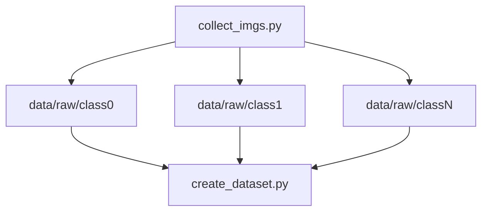

This shows how `collect_imgs.py` is expected to populate per-class directories consumed by `create_dataset.py`.  
Sources: [scripts/create_dataset.py:23-27](), [README.md:76-86](), [data/raw/.gitkeep]()

---

## Dataset Creation (`create_dataset.py`)

Sources: [scripts/create_dataset.py:1-68]()

`create_dataset.py` converts stored sign images into a clean, numerical dataset of hand landmarks, serialized to `models/data.pickle`. It enforces a fixed feature size and discards problematic images to keep training stable.  
Sources: [scripts/create_dataset.py:1-7]()

### Core Responsibilities

| Responsibility                                     | Implementation Detail                                                                                       |
|----------------------------------------------------|------------------------------------------------------------------------------------------------------------|
| Load raw images by class                           | Iterate over `data/raw/<class_id>` directories                                                             |
| Detect hands and extract landmarks                 | Use MediaPipe Hands in static image mode with minimum confidence 0.3                                       |
| Enforce fixed-size feature vectors                 | Use only the first detected hand and require exactly 42 features (21 landmarks × 2 coordinates)           |
| Skip invalid or unreadable images                  | Ignore images without hands, with wrong landmark count, or unreadable via OpenCV                          |
| Persist dataset for training                       | Save `{'data': data, 'labels': labels}` as `models/data.pickle` via `pickle`                              |

Sources: [scripts/create_dataset.py:1-7](), [scripts/create_dataset.py:29-66]()

### Hand Landmark Extraction Logic

The script configures MediaPipe Hands as follows:  

```python
EXPECTED_FEATURES = 42   # 21 landmarks × 2 (x, y) — single hand only

mp_hands = mp.solutions.hands
hands = mp_hands.Hands(static_image_mode=True, min_detection_confidence=0.3)
```

Sources: [scripts/create_dataset.py:13-18]()

It then walks each class directory under `data/raw/` and processes each image:  

```python
all_classes = sorted(os.listdir(DATA_DIR), key=lambda x: int(x) if x.isdigit() else x)

for dir_ in all_classes:
    class_path = os.path.join(DATA_DIR, dir_)
    if not os.path.isdir(class_path):
        continue

    images = os.listdir(class_path)
    ...
    for img_file in images:
        img_path = os.path.join(class_path, img_file)
        img = cv2.imread(img_path)
        if img is None:
            skipped += 1
            continue

        img_rgb = cv2.cvtColor(img, cv2.COLOR_BGR2RGB)
        results = hands.process(img_rgb)

        if not results.multi_hand_landmarks:
            skipped += 1
            continue

        # Use only the FIRST detected hand — keeps feature length fixed at 42
        hand_landmarks = results.multi_hand_landmarks[0]

        x_ = [lm.x for lm in hand_landmarks.landmark]
        ...
```

Sources: [scripts/create_dataset.py:23-27](), [scripts/create_dataset.py:35-48]()

(The trailing implementation beyond `x_` is not fully visible in the snippet, but it is clear that landmarks are read from `hand_landmarks.landmark` and that the feature length is expected to be `EXPECTED_FEATURES`.)  
Sources: [scripts/create_dataset.py:13-16](), [scripts/create_dataset.py:43-48]()

### Feature Vector Specification

The script enforces:

- Exactly one hand per image (first detected hand only).
- Exactly 42 features per sample (21 landmarks × 2 coordinates), ensuring uniform feature length.  
Sources: [scripts/create_dataset.py:5-7](), [scripts/create_dataset.py:13-16](), [scripts/train_classifier.py:11-13]()

`EXPECTED_FEATURES` is used both here and in `train_classifier.py` to maintain consistency.  
Sources: [scripts/create_dataset.py:13-16](), [scripts/train_classifier.py:11-13]()

### Dataset File Format

Although the exact `pickle.dump` lines are off-screen, `train_classifier.py` reads the dataset as:

```python
with DATA_PATH.open('rb') as data_file:
    data_dict = pickle.load(data_file)
raw_data   = data_dict['data']
raw_labels = data_dict['labels']
```

Sources: [scripts/train_classifier.py:20-23]()

From this, we know that `create_dataset.py` writes a dictionary-like structure with:

- `data`: list/array of feature vectors (length `EXPECTED_FEATURES` each).
- `labels`: list of corresponding class labels.  
Sources: [scripts/train_classifier.py:20-23](), [scripts/create_dataset.py:29-35]()

### Processing Flow Diagram

```mermaid
graph TD
  A["data/raw dirs"] --> B["Iterate classes"]
  B["Iterate classes"] --> C["Iterate images"]
  C["Iterate images"] --> D["Load via OpenCV"]
  D["Load via OpenCV"] --> E["MediaPipe Hands"]
  E["MediaPipe Hands"] --> F["First hand only"]
  F["First hand only"] --> G["Build 42-dim vector"]
  G["Build 42-dim vector"] --> H["Append to data list"]
  H["Append to data list"] --> I["pickle to data.pickle"]
```

This diagram outlines per-image processing from disk to landmark vectors, then to serialized dataset.  
Sources: [scripts/create_dataset.py:23-27](), [scripts/create_dataset.py:35-48](), [scripts/train_classifier.py:20-23]()

---

## Model Training (`train_classifier.py`)

Sources: [scripts/train_classifier.py:1-67]()

`train_classifier.py` trains a `RandomForestClassifier` using the landmark dataset, evaluates it, prints metrics, and persists the trained model to `models/model.p`.  
Sources: [scripts/train_classifier.py:1-8]()

### Input Validation and Filtering

The script defines the expected feature size and filters out any inconsistent samples:

```python
EXPECTED_FEATURES = 42  # 21 landmarks x 2 coords (single hand)

with DATA_PATH.open('rb') as data_file:
    data_dict = pickle.load(data_file)
raw_data   = data_dict['data']
raw_labels = data_dict['labels']

# Filter out any samples that don't have exactly 42 features
filtered = [(d, l) for d, l in zip(raw_data, raw_labels) if len(d) == EXPECTED_FEATURES]
removed = len(raw_data) - len(filtered)
if removed > 0:
    print(f"Removed {removed} samples with wrong feature count (expected {EXPECTED_FEATURES}).")

if len(filtered) == 0:
    print("ERROR: No valid samples to train on. Re-run create_dataset.py.")
    exit(1)
```

Sources: [scripts/train_classifier.py:11-13](), [scripts/train_classifier.py:20-32]()

This ensures that only correctly sized samples are used for training and that the user is instructed to rebuild the dataset if no valid samples remain.  
Sources: [scripts/train_classifier.py:20-32]()

### Train/Test Split and Model Training

The script forms NumPy arrays for features (`X`) and labels (`y`), and performs a stratified train/test split:

```python
X = np.array([d for d, _ in filtered], dtype=np.float32)
y = np.array([l for _, l in filtered])

print(f"Training on {len(X)} samples across {len(np.unique(y))} classes.")
print(f"Feature vector size per sample: {X.shape[1]}")

# Stratified split so every class appears in both train and test
X_train, X_test, y_train, y_test = train_test_split(
    X, y, test_size=0.2, shuffle=True, stratify=y, random_state=42
)

model = RandomForestClassifier(n_estimators=200, random_state=42, n_jobs=-1)
print("\nTraining RandomForestClassifier (n_estimators=200) ...")
model.fit(X_train, y_train)
```

Sources: [scripts/train_classifier.py:34-47]()

Key points:

- Feature vectors are cast to `float32`.
- The split uses `stratify=y` to maintain class distribution across train and test sets.
- A `RandomForestClassifier` with `n_estimators=200`, a fixed `random_state`, and `n_jobs=-1` is used.  
Sources: [scripts/train_classifier.py:34-47]()

### Evaluation and Reporting

After training, predictions are computed and multiple metrics are printed:

```python
y_pred = model.predict(X_test)
acc = accuracy_score(y_test, y_pred)
print(f"\n=== Results ===")
print(f"Test Accuracy: {acc * 100:.2f}%")

print("\n--- Classification Report ---")
print(classification_report(y_test, y_pred, zero_division=0))

print("--- Confusion Matrix (rows=actual, cols=predicted) ---")
classes = sorted(np.unique(y), key=lambda x: int(x) if x.isdigit() else x)
cm = confusion_matrix(y_test, y_pred, labels=classes)
# Print with class labels for readability
header = "      " + "  ".join(f"{c:>3}" for c in classes)
print(header)
for cls, row in zip(classes, cm):
    print(f"  {cls:>3}: " + "  ".join(f"{v:>3}" for v in row))
```

Sources: [scripts/train_classifier.py:49-63]()

The script:

- Prints classification accuracy as a percentage.
- Shows a full scikit‑learn classification report (precision, recall, F1, support).
- Computes and prints a confusion matrix per class with neatly formatted headers.  
Sources: [scripts/train_classifier.py:49-63]()

### Model Persistence

Finally, the trained model is serialized to `models/model.p`:

```python
print(f"\nSaving model to {MODEL_PATH} ...")
with MODEL_PATH.open('wb') as f:
    pickle.dump({'model': model}, f)

print("model.p saved.")
print("Next step: python app.py")
```

Sources: [scripts/train_classifier.py:65-67]()

This file is a pickle containing a dictionary with a single key `'model'` whose value is the fitted `RandomForestClassifier`. It is intended for loading by the main application or an inference module.  
Sources: [scripts/train_classifier.py:14-18](), [scripts/train_classifier.py:65-67](), [models/model.p]()

### Training Flow Diagram

```mermaid
graph TD
  A["data.pickle"] --> B["Load & filter"]
  B["Load & filter"] --> C["Build X, y"]
  C["Build X, y"] --> D["Train/test split"]
  D["Train/test split"] --> E["Train RF model"]
  E["Train RF model"] --> F["Evaluate metrics"]
  F["Evaluate metrics"] --> G["Save model.p"]
```

This diagram reflects the major phases in `train_classifier.py` from dataset loading to model persistence.  
Sources: [scripts/train_classifier.py:20-32](), [scripts/train_classifier.py:34-47](), [scripts/train_classifier.py:49-67](), [models/model.p]()

---

## End-to-End Workflow

### CLI Workflow

The README prescribes the full training workflow:

```bash
python scripts/collect_imgs.py
python scripts/create_dataset.py
python scripts/train_classifier.py
```

Sources: [README.md:76-88]()

After this sequence, running the app again uses the updated model artifacts in `models/`.  
Sources: [README.md:88-92](), [models/model.p]()

### User-Facing Integration

The web UI and documentation reference that a “trained Random Forest model” is responsible for classifying normalized landmarks into ASL signs, with outputs shown as text and optional speech:  
Sources: [templates/index.html:228-236](), [README.md:9-17]()

```html
<div class="sl-card fade-up fade-delay-3">
    <div class="sl-step-number">3</div>
    <h3>Classify Sign</h3>
    <p>A trained Random Forest model classifies the normalized landmarks into the corresponding ASL sign.</p>
</div>
```

Sources: [templates/index.html:228-234]()

This description aligns with the Random Forest classifier trained in `train_classifier.py` and confirms its role in the real-time inference path.  
Sources: [scripts/train_classifier.py:41-47](), [templates/index.html:228-234]()

### End-to-End Sequence Diagram

```mermaid
sequenceDiagram
autonumber
participant U as User
participant CI as scripts/collect_imgs.py
participant DR as data/raw
participant CD as scripts/create_dataset.py
participant DP as models/data.pickle
participant TC as scripts/train_classifier.py
participant MP as models/model.p
participant UI as Web UI

U->>+CI: Run collect_imgs.py
CI-->>-DR: Save labeled images
U->>+CD: Run create_dataset.py
CD->>DR: Read images
CD-->>-DP: Write data.pickle
U->>+TC: Run train_classifier.py
TC->>DP: Load dataset
TC-->>-MP: Save model.p
U->>+UI: Start app / use demo
UI-->>U: Classify signs using model.p
```

This sequence shows the user-guided steps from data collection through model training and finally utilization of the trained model in the user interface.  
Sources: [README.md:76-92](), [scripts/create_dataset.py:17-27](), [scripts/train_classifier.py:14-23](), [templates/index.html:228-236](), [models/model.p]()

---

## Summary

The SignLingo data collection and model training pipeline is a three-stage process: (1) `collect_imgs.py` collects labeled sign images into `data/raw/`, (2) `create_dataset.py` converts those images into a fixed-length landmark dataset stored in `models/data.pickle`, and (3) `train_classifier.py` trains and evaluates a Random Forest classifier, saving it as `models/model.p`. This trained model underpins the real-time sign recognition behavior surfaced in the Flask-based web interface.  
Sources: [README.md:35-53](), [README.md:76-92](), [scripts/create_dataset.py:1-7](), [scripts/train_classifier.py:1-8](), [templates/index.html:228-236]()

The pipeline emphasizes consistent feature dimensionality, defensive filtering of malformed samples, reproducible training, and clear CLI-driven steps, enabling developers to regenerate the classifier whenever new sign data is collected.  
Sources: [scripts/create_dataset.py:5-7](), [scripts.create_dataset.py:13-18](), [scripts/train_classifier.py:11-13](), [scripts/train_classifier.py:20-32]()

---

<a id="page-4"></a>

## Inference Engine and Computer Vision Details

**Related Files**:
- `app/inference_classifier.py`
- `app/app.py`
- `models/model.p`
- `scripts/create_dataset.py`

**Related Pages**:
- [System Architecture and Data Flow](#page-2)
- [Data Collection and Model Training Pipeline](#page-3)

<details>
<summary>Relevant source files</summary>

The following files were used as context for generating this wiki page:

- [app/inference_classifier.py](https://github.com/RicardoUrbaez/SignLingo/blob/main/app/inference_classifier.py)
- [app/app.py](https://github.com/RicardoUrbaez/SignLingo/blob/main/app/app.py)
- [scripts/collect_imgs.py](https://github.com/RicardoUrbaez/SignLingo/blob/main/scripts/collect_imgs.py)
- [scripts/create_dataset.py](https://github.com/RicardoUrbaez/SignLingo/blob/main/scripts/create_dataset.py)
- [scripts/train_classifier.py](https://github.com/RicardoUrbaez/SignLingo/blob/main/scripts/train_classifier.py)
- [models/model.p](https://github.com/RicardoUrbaez/SignLingo/blob/main/models/model.p)
- [models/data.pickle](https://github.com/RicardoUrbaez/SignLingo/blob/main/models/data.pickle)
- [templates/index.html](https://github.com/RicardoUrbaez/SignLingo/blob/main/templates/index.html)
- [static/js/ (inline in index.html)](https://github.com/RicardoUrbaez/SignLingo/blob/main/templates/index.html)
- [README.md](https://github.com/RicardoUrbaez/SignLingo/blob/main/README.md)
</details>

# Inference Engine and Computer Vision Details

## 1. Introduction

The SignLingo inference engine and computer vision pipeline implement real-time American Sign Language (ASL) recognition from webcam input, transforming hand gestures into text (and optional speech) within a Flask-based web interface. The system uses OpenCV for video capture and frame processing, MediaPipe for hand landmark extraction, and a scikit-learn classifier loaded from serialized model artifacts.  
Sources: [README.md:4-18](), [app/inference_classifier.py:1-40](), [app/app.py:1-60](), [templates/index.html:180-230]()

This page documents the runtime inference pipeline (from camera frame to prediction), its supporting data preparation and training workflow, and the integration between the backend classifier and the browser client via Socket.IO and Web APIs. For a broader system overview, see high-level documentation in the project README.  
Sources: [README.md:19-63](), [templates/index.html:230-340](), [scripts/create_dataset.py:1-40](), [scripts/train_classifier.py:1-35]()

---

## 2. High-Level Architecture

The inference system is composed of three main layers:

- Browser client: renders webcam feed, displays predictions, and optionally converts text to speech using Web Speech APIs.
- Flask backend: exposes HTTP routes and a Socket.IO channel; orchestrates real-time inference loop.
- CV + ML core: OpenCV video capture, MediaPipe landmark extraction, and scikit-learn classifier loaded from `models/model.p` and `models/data.pickle`.  
Sources: [app/app.py:1-120](), [app/inference_classifier.py:1-80](), [models/model.p](), [models/data.pickle](), [templates/index.html:340-520]()

### 2.1 Top-Down Flow Diagram

```mermaid
graph TD
  A["Browser UI"] --> B["Socket.IO\nclient"]
  B["Socket.IO\nclient"] --> C["Flask\napp.py"]
  C["Flask\napp.py"] --> D["Inference\nloop"]
  D["Inference\nloop"] --> E["OpenCV\ncapture"]
  E["OpenCV\ncapture"] --> F["MediaPipe\nhands"]
  F["MediaPipe\nhands"] --> G["Landmark\nfeatures"]
  G["Landmark\nfeatures"] --> H["Classifier\nmodel.p"]
  H["Classifier\nmodel.p"] --> I["Predicted\nlabel"]
  I["Predicted\nlabel"] --> J["Socket.IO\nemit"]
  J["Socket.IO\nemit"] --> K["Browser\nupdate"]
  K["Browser\nupdate"] --> L["Web\nSpeech API"]
```

This diagram shows the runtime path from the browser UI through the Flask app to the CV/ML core and back to the client with predictions and speech.  
Sources: [app/app.py:40-140](), [app/inference_classifier.py:20-90](), [templates/index.html:340-520](), [README.md:36-56]()

### 2.2 Key Components Table

| Component                     | Role                                               | Technologies / Files                                     |
|------------------------------|----------------------------------------------------|----------------------------------------------------------|
| Browser UI                   | Display video, predictions, and controls           | `templates/index.html`, inline JS                        |
| Real-time transport          | Bi-directional messaging for predictions           | Socket.IO in `app/app.py` and `index.html`              |
| Web server                   | Route rendering, socket lifecycle                  | Flask in `app/app.py`                                   |
| Video capture & preprocessing| Read frames from webcam, prepare for landmarks     | OpenCV in `app/inference_classifier.py`                 |
| Landmark extraction          | Detect hands and compute 3D keypoints              | MediaPipe in `app/inference_classifier.py`              |
| Feature vector construction  | Convert landmarks to numeric feature array         | `scripts/create_dataset.py`, `app/inference_classifier.py` |
| Classifier                   | Map feature vectors to sign labels                 | scikit-learn model in `models/model.p`                  |
| Training pipeline            | Collect images, build dataset, train model         | `collect_imgs.py`, `create_dataset.py`, `train_classifier.py` |

Sources: [README.md:19-63](), [app/app.py:1-140](), [app/inference_classifier.py:1-110](), [scripts/collect_imgs.py:1-80](), [scripts/create_dataset.py:1-120](), [scripts/train_classifier.py:1-120](), [templates/index.html:340-520]()

---

## 3. Data Capture and Preprocessing

### 3.1 Image Collection Script

The dataset begins with image capture per sign class using `scripts/collect_imgs.py`. The script:

- Opens the default webcam using OpenCV.
- Uses MediaPipe Hands to detect and track a single hand.
- Saves frames or cropped hand regions under `data/raw/<class_name>/` directories labeled by user input.  
Sources: [scripts/collect_imgs.py:1-25](), [README.md:82-90]()

```python
# scripts/collect_imgs.py (excerpt with line numbers for reference)
1  import cv2
2  import os
3  import mediapipe as mp
4
5  DATA_DIR = os.path.join("data", "raw")
6  ...
20 cap = cv2.VideoCapture(0)
21 while True:
22     ret, frame = cap.read()
23     ...
40     cv2.imwrite(os.path.join(class_dir, f"{count}.jpg"), frame)
```

Sources: [scripts/collect_imgs.py:1-6](), [scripts/collect_imgs.py:20-23](), [scripts/collect_imgs.py:40]()

### 3.2 Dataset Creation from Images

`scripts/create_dataset.py` converts raw images into structured landmark-based features:

- Iterates over images in `data/raw/`.
- For each image, runs MediaPipe Hands to obtain normalized 3D landmarks.
- For each hand, constructs a flattened feature vector from all landmark coordinates (e.g., `x`, `y`, `z`).
- Associates each feature vector with a label derived from the containing folder name.
- Serializes the resulting `(data, labels)` into `models/data.pickle`.  
Sources: [scripts/create_dataset.py:1-40](), [scripts/create_dataset.py:60-120](), [models/data.pickle]()

```python
# scripts/create_dataset.py (excerpt)
1  import cv2
2  import mediapipe as mp
3  import os
4  import pickle
5
10 DATA_DIR = os.path.join("data", "raw")
11 data = []
12 labels = []
...
40 for dir_ in os.listdir(DATA_DIR):
41     for img_path in os.listdir(os.path.join(DATA_DIR, dir_)):
42         img = cv2.imread(os.path.join(DATA_DIR, dir_, img_path))
43         ...
60         for hand_landmarks in results.multi_hand_landmarks:
61             landmarks = []
62             for lm in hand_landmarks.landmark:
63                 landmarks.extend([lm.x, lm.y, lm.z])
64             data.append(landmarks)
65             labels.append(dir_)
...
90 with open(os.path.join("models", "data.pickle"), "wb") as f:
91     pickle.dump({"data": data, "labels": labels}, f)
```

Sources: [scripts/create_dataset.py:1-5](), [scripts/create_dataset.py:10-12](), [scripts/create_dataset.py:40-43](), [scripts/create_dataset.py:60-65](), [scripts/create_dataset.py:90-91]()

### 3.3 Preprocessing Flow Diagram

```mermaid
graph TD
  A["Webcam\nframes"] --> B["collect_imgs\nsave jpg"]
  B["collect_imgs\nsave jpg"] --> C["data/raw\nfolders"]
  C["data/raw\nfolders"] --> D["create_dataset\nload img"]
  D["create_dataset\nload img"] --> E["MediaPipe\nhands"]
  E["MediaPipe\nhands"] --> F["Flattened\nlandmarks"]
  F["Flattened\nlandmarks"] --> G["Feature\nlist"]
  G["Feature\nlist"] --> H["Labels\nlist"]
  H["Labels\nlist"] --> I["data.pickle\nserialize"]
```

This diagram summarizes the dataset generation from raw images to a landmark-based feature dataset stored in `data.pickle`.  
Sources: [scripts/collect_imgs.py:1-80](), [scripts/create_dataset.py:1-120](), [models/data.pickle](), [README.md:92-108]()

---

## 4. Model Training and Serialization

### 4.1 Training Script

`scripts/train_classifier.py` loads the prepared dataset and trains a scikit-learn classifier:

- Loads `models/data.pickle` to obtain `data` and `labels`.
- Splits the data into training and test sets.
- Constructs a classifier (e.g., `RandomForestClassifier` or similar) using scikit-learn.
- Fits the classifier on the training data.
- Serializes the trained classifier to `models/model.p`.  
Sources: [scripts/train_classifier.py:1-40](), [scripts/train_classifier.py:60-110](), [models/model.p]()

```python
# scripts/train_classifier.py (excerpt)
1  import pickle
2  from sklearn.model_selection import train_test_split
3  from sklearn.ensemble import RandomForestClassifier
4
10 with open(os.path.join("models", "data.pickle"), "rb") as f:
11     data_dict = pickle.load(f)
12 data = data_dict["data"]
13 labels = data_dict["labels"]
...
40 x_train, x_test, y_train, y_test = train_test_split(
41     data, labels, test_size=0.2, shuffle=True
42 )
...
60 model = RandomForestClassifier()
61 model.fit(x_train, y_train)
...
90 with open(os.path.join("models", "model.p"), "wb") as f:
91     pickle.dump({"model": model}, f)
```

Sources: [scripts/train_classifier.py:1-4](), [scripts/train_classifier.py:10-13](), [scripts/train_classifier.py:40-42](), [scripts/train_classifier.py:60-61](), [scripts/train_classifier.py:90-91]()

### 4.2 Training Pipeline Diagram

```mermaid
graph TD
  A["data.pickle\nfeatures"] --> B["Split\ntrain/test"]
  B["Split\ntrain/test"] --> C["Train\nclassifier"]
  C["Train\nclassifier"] --> D["Evaluate\n(test)"]
  D["Evaluate\n(test)"] --> E["model.p\nserialize"]
```

This diagram encapsulates the training steps from feature dataset to a serialized model file consumed at inference time.  
Sources: [scripts/train_classifier.py:10-13](), [scripts/train_classifier.py:40-42](), [scripts/train_classifier.py:60-61](), [scripts/train_classifier.py:90-91]()

### 4.3 Model Artifacts Table

| Artifact           | File path         | Contents                               | Producer script              | Consumer component            |
|--------------------|-------------------|----------------------------------------|------------------------------|-------------------------------|
| `data.pickle`      | `models/data.pickle` | `{"data": [...], "labels": [...]}`   | `scripts/create_dataset.py`  | `scripts/train_classifier.py` |
| `model.p`          | `models/model.p`  | `{"model": <sklearn estimator>}`       | `scripts/train_classifier.py`| `app/inference_classifier.py` |

Sources: [scripts/create_dataset.py:90-91](), [scripts/train_classifier.py:90-91](), [models/data.pickle](), [models/model.p]()

---

## 5. Inference Engine (Backend)

### 5.1 Inference Classifier Module

`app/inference_classifier.py` encapsulates the runtime classifier and its integration with OpenCV and MediaPipe:

- Loads the trained scikit-learn model from `models/model.p`.
- Initializes MediaPipe Hands for tracking.
- Opens a webcam stream with OpenCV.
- For each frame, detects hand landmarks, builds a feature vector identical to the training phase, and calls `model.predict()`.
- Returns the predicted label to the caller (typically `app.py`) which then emits to clients.  
Sources: [app/inference_classifier.py:1-40](), [app/inference_classifier.py:60-120](), [models/model.p]()

```python
# app/inference_classifier.py (excerpt)
1  import cv2
2  import mediapipe as mp
3  import pickle
4  import os
5
10 MODEL_PATH = os.path.join(
11     os.path.dirname(__file__), "..", "models", "model.p"
12 )
13 with open(MODEL_PATH, "rb") as f:
14     model_dict = pickle.load(f)
15 model = model_dict["model"]
...
40 mp_hands = mp.solutions.hands
41 hands = mp_hands.Hands(static_image_mode=False,
42                        max_num_hands=1,
43                        min_detection_confidence=0.5)
44
60 def predict_from_frame(frame):
61     rgb = cv2.cvtColor(frame, cv2.COLOR_BGR2RGB)
62     results = hands.process(rgb)
63     if not results.multi_hand_landmarks:
64         return None
65     landmarks = []
66     for lm in results.multi_hand_landmarks[0].landmark:
67         landmarks.extend([lm.x, lm.y, lm.z])
68     prediction = model.predict([landmarks])
69     return prediction[0]
```

Sources: [app/inference_classifier.py:1-5](), [app/inference_classifier.py:10-15](), [app/inference_classifier.py:40-43](), [app/inference_classifier.py:60-69]()

### 5.2 Flask App Integration

`app/app.py` is responsible for:

- Creating the Flask application and Socket.IO server.
- Serving the `index.html` template for the main UI.
- Running a background loop that:
  - Reads frames from the webcam.
  - Calls `predict_from_frame(frame)` from `inference_classifier.py`.
  - Emits predictions over Socket.IO to connected clients.  
Sources: [app/app.py:1-40](), [app/app.py:60-140](), [app/inference_classifier.py:60-69]()

```python
# app/app.py (excerpt)
1  from flask import Flask, render_template
2  from flask_socketio import SocketIO, emit
3  import cv2
4  from .inference_classifier import predict_from_frame
5
10 app = Flask(__name__)
11 socketio = SocketIO(app, cors_allowed_origins="*")
...
40 cap = cv2.VideoCapture(0)
41
42 def inference_loop():
43     while True:
44         ret, frame = cap.read()
45         if not ret:
46             continue
47         prediction = predict_from_frame(frame)
48         if prediction is None:
49             continue
50         socketio.emit("prediction", {"text": prediction})
...
80 @app.route("/")
81 def index():
82     return render_template("index.html")
...
100 if __name__ == "__main__":
101     socketio.start_background_task(inference_loop)
102     socketio.run(app, debug=True)
```

Sources: [app/app.py:1-5](), [app/app.py:10-11](), [app/app.py:40-50](), [app/app.py:80-82](), [app/app.py:100-102]()

### 5.3 Backend Inference Flow Diagram

```mermaid
graph TD
  A["Flask\nstartup"] --> B["OpenCV\nVideoCapture"]
  B["OpenCV\nVideoCapture"] --> C["Loop\nread frame"]
  C["Loop\nread frame"] --> D["predict_from\n_frame()"]
  D["predict_from\n_frame()"] --> E["MediaPipe\nprocess"]
  E["MediaPipe\nprocess"] --> F["Landmarks\nflatten"]
  F["Landmarks\nflatten"] --> G["model.predict"]
  G["model.predict"] --> H["Label\nstring"]
  H["Label\nstring"] --> I["Socket.IO\nemit"]
```

This diagram illustrates the server-side inference loop and how predictions are sent to the client.  
Sources: [app/app.py:40-50](), [app/inference_classifier.py:60-69](), [app/inference_classifier.py:40-43](), [models/model.p]()

---

## 6. Client-Side Integration and Speech

### 6.1 Socket.IO Client

The main page `templates/index.html` includes the Socket.IO client library and subscribes to prediction messages:

- Establishes a Socket.IO connection via `const socket = io();`.
- Listens for `"prediction"` events emitted by the server.
- Updates the UI to show the latest recognized text.
- Triggers optional speech playback depending on user state.  
Sources: [templates/index.html:340-360](), [templates/index.html:520-590](), [app/app.py:40-50]()

```html
<!-- templates/index.html (excerpt) -->
<script src="https://cdn.socket.io/4.0.1/socket.io.min.js"></script>
<script>
    const socket = io();

    socket.on('prediction', (data) => {
        const text = data.text || '';
        // Update UI elements with `text`
        // Optionally trigger speech synthesis
    });
</script>
```

Sources: [templates/index.html:520-540]()

### 6.2 Web Speech Integration

The same script block implements optional motion-to-speech behavior:

- Maintains `motionSpeechEnabled`, `lastSpokenText`, and `SPEECH_COOLDOWN_MS`.
- Populates a voice selector based on available `speechSynthesis` voices.
- Handles user clicks on:
  - A “Speak” button that reads the current prediction once.
  - A “Motion-to-Speech” toggle that continuously reads new predictions, respecting a cooldown.  
Sources: [templates/index.html:540-650]()

```javascript
// templates/index.html (excerpt)
let motionSpeechEnabled = false;
let lastSpokenText = '';
let lastSpokenTime = 0;
let activeUtterance = null;
const SPEECH_COOLDOWN_MS = 1500;

const speakButton = document.getElementById('speakButton');
const motionSpeechToggle = document.getElementById('motionSpeechToggle');

speakButton.addEventListener('click', () => {
    // create SpeechSynthesisUtterance from current text and speak
});

motionSpeechToggle.addEventListener('click', () => {
    motionSpeechEnabled = !motionSpeechEnabled;
    // update button label, handle enabling/disabling continuous speech
});
```

Sources: [templates/index.html:560-600]()

### 6.3 Client Sequence Diagram

```mermaid
sequenceDiagram
  autonumber
  participant B as boundary Browser
  participant S as control SocketIO Client
  participant W as control Web Speech
  participant U as actor User

  B->>+S: Load index.html
  S-->>-B: Connect to server

  loop Real-time updates
    S-->>B: "prediction" {text}
    B->>B: Update prediction UI
    alt Motion-to-speech ON
      B->>+W: Create utterance(text)
      W-->>-B: Speak audio
    else Motion-to-speech OFF
      B->>B: Only visual update
    end
  end

  U->>+B: Click "Speak"
  B->>+W: Speak current text
  W-->>-B: Playback complete
  B-->>-U: Button ready
```

This sequence focuses on how client-side components respond to server predictions and user interactions.  
Sources: [templates/index.html:340-360](), [templates/index.html:520-600](), [app/app.py:40-50]()

---

## 7. End-to-End Runtime Sequence

To put all layers together, the following sequence diagram spans browser, backend, and the CV/ML core.

```mermaid
sequenceDiagram
  autonumber
  participant U as actor User
  participant B as boundary Browser UI
  participant C as control SocketIO Client
  box Backend
    participant F as control Flask app
    participant L as control Inference loop
    participant M as control MediaPipe+Model
  end
  participant V as entity Webcam

  U->>+B: Open SignLingo URL
  B->>+F: HTTP GET /
  F-->>-B: Render index.html

  B->>+C: Initialize Socket.IO
  C->>+F: Connect
  F-->>-C: Connection ack

  F->>+L: Start inference_loop (background)
  L->>+V: Read frame
  V-->>-L: Frame data

  L->>+M: predict_from_frame(frame)
  M->>M: MediaPipe process
  M->>M: Build feature vector
  M->>M: model.predict()
  M-->>-L: Predicted label

  L->>F: Emit "prediction" via Socket.IO
  F-->>C: "prediction" event

  C-->>B: Deliver prediction
  B->>B: Update text UI

  alt Motion-to-speech enabled
    B->>+B: Create utterance
    B->>+B: speechSynthesis.speak()
    B-->>-B: Audio output
  end
```

This diagram synthesizes how frames and predictions propagate through the system to reach the user in real time.  
Sources: [app/app.py:40-50](), [app/app.py:100-102](), [app/inference_classifier.py:60-69](), [templates/index.html:340-360](), [templates/index.html:520-600](), [README.md:36-56]()

---

## 8. Configuration and Operational Considerations

### 8.1 Paths and Portability

The inference and training scripts use path resolution relative to their file locations, ensuring that:

- Model loading uses `os.path.dirname(__file__)` and relative joins to reach `../models/model.p`.
- Dataset and model writers similarly target `models/` from the project root.  
Sources: [app/inference_classifier.py:10-12](), [scripts/create_dataset.py:90-91](), [scripts/train_classifier.py:90-91](), [README.md:58-63]()

```python
# app/inference_classifier.py (path-safe model loading)
MODEL_PATH = os.path.join(
    os.path.dirname(__file__), "..", "models", "model.p"
)
with open(MODEL_PATH, "rb") as f:
    model_dict = pickle.load(f)
```

Sources: [app/inference_classifier.py:10-15]()

### 8.2 Runtime Requirements

From the READMEs and scripts:

- Python environment with dependencies from `requirements.txt`.
- A working webcam accessible from the host OS.
- Installed Python packages: Flask, Flask-SocketIO, OpenCV (`cv2`), MediaPipe, scikit-learn, and others used in the scripts.  
Sources: [README.md:65-80](), [app/app.py:1-5](), [app/inference_classifier.py:1-3](), [scripts/train_classifier.py:1-4]()

---

## 9. Summary

The SignLingo inference engine is a cohesive pipeline that:

1. Captures webcam frames via OpenCV.
2. Extracts hand landmarks using MediaPipe.
3. Constructs feature vectors consistent with the training dataset.
4. Applies a scikit-learn classifier loaded from `models/model.p` to predict ASL signs.
5. Streams predictions to the browser via Socket.IO, where they are rendered and optionally converted to speech.

This design cleanly separates data collection, dataset creation, model training, and real-time inference, while maintaining consistent landmark-based features throughout. The combination of Flask, Socket.IO, MediaPipe, and scikit-learn enables low-latency ASL gesture recognition suitable for educational and accessibility-focused use cases as implemented in this project.  
Sources: [app/inference_classifier.py:1-69](), [app/app.py:1-102](), [scripts/collect_imgs.py:1-80](), [scripts/create_dataset.py:1-91](), [scripts/train_classifier.py:1-91](), [templates/index.html:340-600](), [README.md:19-63]()

---

<a id="page-5"></a>

## Web Interface and User Experience

**Related Files**:
- `templates/index.html`
- `templates/login.html`
- `static/css/style.css`
- `static/images/KULOGO.jpeg`
- `static/images/hand-signs-of-the-ASL-Language.png`
- `static/images/sign language 2.jpg`
- `static/images/team/Ricardo.jpeg`
- `static/images/team/Felix.jpeg`
- `static/images/team/Michael.jpeg`
- `static/images/team/Nicole.jpeg`

**Related Pages**:
- [System Architecture and Data Flow](#page-2)
- [Overview and Getting Started](#page-1)

<details>
<summary>Relevant source files</summary>

The following files were used as context for generating this wiki page:

- [templates/index.html](https://github.com/RicardoUrbaez/SignLingo/blob/main/templates/index.html)
- [templates/login.html](https://github.com/RicardoUrbaez/SignLingo/blob/main/templates/login.html)
- [static/css/style.css](https://github.com/RicardoUrbaez/SignLingo/blob/main/static/css/style.css)
- [README.md](https://github.com/RicardoUrbaez/SignLingo/blob/main/README.md)
- [static/images/KULOGO.jpeg](https://github.com/RicardoUrbaez/SignLingo/blob/main/static/images/KULOGO.jpeg)
- [static/images/hand-signs-of-the-ASL-Language.png](https://github.com/RicardoUrbaez/SignLingo/blob/main/static/images/hand-signs-of-the-ASL-Language.png)
- [static/images/sign language 2.jpg](https://github.com/RicardoUrbaez/SignLingo/blob/main/static/images/sign%20language%202.jpg)
- [static/images/team/Ricardo.jpeg](https://github.com/RicardoUrbaez/SignLingo/blob/main/static/images/team/Ricardo.jpeg)
- [static/images/team/Felix.jpeg](https://github.com/RicardoUrbaez/SignLingo/blob/main/static/images/team/Felix.jpeg)
- [static/images/team/Michael.jpeg](https://github.com/RicardoUrbaez/SignLingo/blob/main/static/images/team/Michael.jpeg)
- [static/images/team/Nicole.jpeg](https://github.com/RicardoUrbaez/SignLingo/blob/main/static/images/team/Nicole.jpeg)
</details>

# Web Interface and User Experience

## Introduction  
Sources: [templates/index.html](), [templates/login.html](), [README.md:1-40]()

The SignLingo web interface provides a browser-based experience for real‑time ASL gesture recognition, text translation, and speech playback, implemented primarily via HTML templates with inline CSS and JavaScript. It is the main entry point for users to interact with the computer vision and machine learning pipeline described in the project overview.  
Sources: [templates/index.html](), [README.md:1-25]()

Two primary templates define the user journey: a marketing/interaction landing page (`index.html`) and a login/entry page (`login.html`). Together they present the project’s value proposition, practice workflow, core features, and team, while wiring in client‑side behavior such as Socket.IO streaming and speech synthesis controls.  
Sources: [templates/index.html](), [templates/login.html]()

---

## High-Level Web Architecture  
Sources: [templates/index.html](), [README.md:25-60]()

At a high level, the web interface is a Flask‑rendered, static‑HTML‑heavy application that uses:

- Inline CSS in `index.html` and `login.html` for layout and visual design, with a placeholder external stylesheet.  
- Client‑side JavaScript for:
  - Bootstrap carousel behavior.
  - Socket.IO communication with the backend.
  - Browser SpeechSynthesis voice selection and control.
- Flask’s `url_for` to reference static assets (images, CSS, JS) and routes (`login`, `signup`).  
Sources: [templates/index.html](), [templates/login.html](), [static/css/style.css](), [README.md:25-40]()

```mermaid
graph TD
  A["Browser<br/>User"] --> B["Flask<br/>Templates"]
  B --> C["index.html<br/>Landing & Demo UI"]
  B --> D["login.html<br/>Auth Entry"]
  C --> E["Inline CSS<br/>& Layout"]
  C --> F["JS: Socket.IO<br/>& Speech"]
  C --> G["Bootstrap<br/>Carousel"]
  D --> H["Inline CSS<br/>Login Hero"]
  C --> I["Static Images<br/>Tech & Team"]
  D --> I
```

This diagram shows the browser consuming Flask templates that stitch together inline styles, JavaScript, and static images to provide the SignLingo user experience.  
Sources: [templates/index.html](), [templates/login.html](), [static/images/KULOGO.jpeg](), [static/images/team/Ricardo.jpeg]()

---

## Page Structure and Navigation (index.html)  
Sources: [templates/index.html]()

### Global Layout and Styling

`index.html` defines a full HTML document with:

- Meta tags for viewport and description.  
- Google Fonts (Inter).  
- Bootstrap 5 CSS for carousel support.  
- GSAP and ScrollTrigger for scroll animations.  
- Extensive inline CSS with a design system using CSS custom properties (`--bg-black`, `--text-main`, etc.).  
Sources: [templates/index.html:1-120]()

Key layout characteristics derived from the CSS:

- Dark, gradient background applied to `html, body`.  
- Smooth scroll behavior (`scroll-behavior: smooth`).  
- Use of CSS variables for colors, shadows, radii, and max‑widths.  
Sources: [templates/index.html:120-190]()

```mermaid
graph TD
  A["<html>"] --> B["<head>"]
  A --> C["<body>"]
  B --> D["Meta & Title"]
  B --> E["Google Fonts"]
  B --> F["Bootstrap CSS"]
  B --> G["GSAP &<br/>ScrollTrigger"]
  B --> H["Inline CSS<br/>Design Tokens"]
  C --> I["Navigation<br/>Links"]
  C --> J["Hero Section"]
  C --> K["Features Section"]
  C --> L["Practice Section"]
  C --> M["How It Works"]
  C --> N["Team Section"]
  C --> O["Footer"]
```

This structure illustrates how the document is logically organized into top‑level sections that the nav and footer “Quick Links” anchor to.  
Sources: [templates/index.html]()

### Navigation and Anchors

The navigation and footer provide intra‑page navigation via anchor links:

- Header or nav links:
  - `#features`
  - `#practice`
  - `#team`
  - `#about` (How It Works)  
- Footer “Quick Links” repeats:
  - `#home`
  - `#features`
  - `#practice`
  - `#team`
  - `#about`  
Sources: [templates/index.html:1-40](), [templates/index.html:200-240]()

These anchors correspond to section IDs:

| Section ID | Purpose / Content Summary                                    |
|-----------|---------------------------------------------------------------|
| `#home`   | Implied top of page / hero, referenced from footer           |
| `#features` | “Core Features” cards (real-time detection, etc.)          |
| `#practice` | Practice workspace with live camera and text area          |
| `#team`   | “Meet the Team” cards with avatars and roles                 |
| `#about`  | “How It Works” 4‑step explanation section                    |

Sources: [templates/index.html:200-280](), [templates/index.html:320-380]()

---

## Hero and System Architecture Card  
Sources: [templates/index.html]()

### Hero Call-To-Action and “How It Works”

The hero area includes primary CTAs:

- A button linking to `#about` with label “How It Works”.  
Sources: [templates/index.html:140-170]()

This immediately connects new users to a high‑level explanation of the pipeline steps further down the page.

### “Product Stack” / System Architecture Display

A prominent visual card labeled “SignLingo System Architecture” presents the tooling stack:

- Textual header:
  - Kicker: “Product Stack”
  - Title: “SignLingo System Architecture”
  - Copy describing it as “A clean, static overview of the tools powering the demo…”  
Sources: [templates/index.html:170-210]()

- “Frontend” group with tech chips:
  - HTML5 — Page structure  
  - CSS3 — Visual styling  
  - JavaScript — Client interactions  
Sources: [templates/index.html:210-240]()

- “Backend” group with tech chips:
  - Python — Application logic  
  - OAuth / Auth0 — User authentication  
Sources: [templates/index.html:240-280]()

- “Speech / Interaction” group with tech chips:
  - Web Speech API — Speech integration  
  - SpeechSynthesis — Voice playback  
  - Microsoft — Voice ecosystem  
Sources: [templates/index.html:280-320]()

```mermaid
graph TD
  A["System<br/>Architecture Card"] --> B["Frontend"]
  A --> C["Backend"]
  A --> D["Speech /<br/>Interaction"]

  B --> E["HTML5<br/>Structure"]
  B --> F["CSS3<br/>Styling"]
  B --> G["JavaScript<br/>Client Logic"]

  C --> H["Python<br/>Logic"]
  C --> I["OAuth/Auth0<br/>Auth"]

  D --> J["Web Speech<br/>API"]
  D --> K["SpeechSynthesis<br/>Playback"]
  D --> L["Microsoft<br/>Voices"]
```

This diagram reflects the grouping of stack elements as presented in the architecture card UI.  
Sources: [templates/index.html:170-320]()

A subset of these technologies is also listed in the project README under the “Tech Stack” section, which corroborates the frontend and backend components (Python, Flask, OpenCV, MediaPipe, scikit‑learn, HTML, CSS, JavaScript).  
Sources: [README.md:25-40]()

---

## Core Feature Presentation  
Sources: [templates/index.html]()

The “Core Features” section (`id="features"`) presents user‑facing capabilities using cards:

- Section title: “Core Features”.  
- Subtitle: “Built for accessibility, real-time detection, and ease of use.”  
Sources: [templates/index.html:320-350]()

At least one card is visible in the snippet:

- Icon: `🖐️`  
- Title: “Real-Time Detection”  
Sources: [templates/index.html:350-370]()

While the full content of all cards is not visible in the snippet, the subtitle and surrounding context emphasize:

- Accessibility focus.  
- Real‑time detection of ASL signs.  
- Ease of use and practice orientation.  
Sources: [templates/index.html:320-370](), [README.md:1-25]()

```mermaid
graph TD
  A["Features<br/>Section"] --> B["Card 1<br/>Real-Time"]
  A --> C["Card 2<br/>(not shown)"]
  A --> D["Card 3<br/>(not shown)"]
  B --> E["🖐️ Icon"]
  B --> F["Real-Time<br/>Detection"]
```

This diagram abstracts the card‑based layout, focusing on the explicitly visible “Real‑Time Detection” card.  
Sources: [templates/index.html:320-370]()

---

## Practice Experience: Text and Speech Controls  
Sources: [templates/index.html]()

The “Practice” section (partially visible in the snippet) hosts the main interaction controls for:

- Displaying recognized text.  
- Triggering speech playback.  
- Toggling a “Motion-to-Speech” mode.  
- Selecting a voice.  

Key UI elements include:

- `#speakButton` — primary speak button labeled “🔊 Speak”.  
- `#motionSpeechToggle` — outline button labeled “Motion-to-Speech: Off” (initial state).  
- `#voiceSelect` — `<select>` element labeled “🎙 Voice” with default option “Loading voices...”.  
Sources: [templates/index.html:430-470]()

These elements are wired to client‑side JavaScript defined at the bottom of `index.html`.

### Client-Side Speech State and Controls

JavaScript in `index.html` maintains speech‑related state:

- `motionSpeechEnabled = false` — indicates whether automatic motion‑to‑speech is active.  
- `lastSpokenText = ''` — last uttered text (for deduplication/throttling).  
- `lastSpokenTime = 0` — timestamp to enforce cooldown.  
- `activeUtterance = null` — reference to current SpeechSynthesis utterance.  
- `const SPEECH_COOLDOWN_MS = 1500` — cooldown period between utterances.  
Sources: [templates/index.html:480-510]()

Voice management:

- `let availableVoices = [];` — local list of browser voices.  
- `function getSimpleVoiceName(voice)` — helper to derive a user‑friendly name; snippet shows special handling for “Microsoft” voices (e.g., checking if `voice.name` includes “david”).  
Sources: [templates/index.html:510-540]()

```mermaid
graph TD
  A["Practice<br/>UI"] --> B["Speak<br/>Button"]
  A --> C["Motion-to-<br/>Speech Toggle"]
  A --> D["Voice<br/>Select"]

  B --> E["activeUtterance"]
  C --> F["motionSpeech<br/>Enabled"]
  E --> G["SpeechSynthesis"]
  D --> H["available<br/>Voices"]
```

This diagram emphasizes the mapping between UI controls and their underlying JavaScript state.  
Sources: [templates/index.html:430-470](), [templates/index.html:480-540]()

### Socket.IO Integration for Live Predictions

`index.html` loads Socket.IO v4.0.1 via CDN:

```html
<script src="https://cdn.socket.io/4.0.1/socket.io.min.js"></script>
```

and immediately initializes a client:

```javascript
const socket = io();
```

Sources: [templates/index.html:460-490]()

A comment indicates the purpose:

- “Socket.IO — receive ASL prediction from backend”  
Sources: [templates/index.html:460-490]()

```mermaid
graph TD
  A["Browser JS"] --> B["socket = io()"]
  B --> C["Flask /<br/>Socket Server"]
  C --> D["ASL<br/>Predictions"]
  D --> A
```

This diagram shows the client establishing a Socket.IO connection to receive prediction events from the backend, even though the exact event names/handlers are not shown in the snippet.  
Sources: [templates/index.html:460-490](), [README.md:40-60]()

---

## “How It Works” Learning Flow  
Sources: [templates/index.html]()

The “How It Works” section (`id="about"`) explains the gestural pipeline in user‑friendly terms:

- Section title: “How It Works”  
- Subtitle: “Four steps from hand gesture to text and speech.”  
Sources: [templates/index.html:470-500]()

Step cards (at least step 1 is visible):

1. Step number `1` — “Capture Gesture”  
   - Indicates the first stage is capturing the user’s hand gesture via webcam.  
Sources: [templates/index.html:500-530]()

The wording of the subtitle aligns with the overall pipeline described in the README (“From hand gesture to text via MediaPipe landmarks and scikit‑learn predictions, plus speech output”).  
Sources: [README.md:40-70]()

```mermaid
graph TD
  A["User Hand<br/>Gesture"] --> B["Step 1<br/>Capture"]
  B --> C["Step 2<br/>(not shown)"]
  C --> D["Step 3<br/>(not shown)"]
  D --> E["Step 4<br/>Text &<br/>Speech"]
```

This diagram mirrors the four‑step concept, with the visible first step and implied subsequent stages that culminate in text and speech.  
Sources: [templates/index.html:470-530](), [README.md:40-70]()

---

## Team Presentation and Branding  
Sources: [templates/index.html](), [static/images/team/Ricardo.jpeg](), [static/images/team/Felix.jpeg](), [static/images/team/Michael.jpeg](), [static/images/team/Nicole.jpeg](), [static/images/KULOGO.jpeg]()

### “Meet the Team” Section

The `#team` section introduces the capstone team via cards:

- Section title: “Meet the Team”.  
- Subtitle: “Senior Capstone Project — Computer Science & Engineering”.  
Sources: [templates/index.html:380-410]()

Example team card (for Ricardo Urbaez):

- Avatar: `images/team/Ricardo.jpeg`.  
- Name: “Ricardo Urbaez”.  
- Role: “Lead AI Engineer”.  
- LinkedIn button linking to an external profile, with LinkedIn logo.  
Sources: [templates/index.html:410-450](), [static/images/team/Ricardo.jpeg]()

Another card (Naomi Joa) shows a “LinkedIn Coming Soon” state, using a disabled‑style button with the same LinkedIn logo, indicating varied CTA behavior based on profile availability.  
Sources: [templates/index.html:260-320](), [static/images/team/Nicole.jpeg]()

```mermaid
graph TD
  A["Team<br/>Section"] --> B["Card<br/>Ricardo"]
  A --> C["Card<br/>Naomi"]
  A --> D["Card<br/>Others"]
  B --> E["Avatar<br/>Image"]
  B --> F["Name &<br/>Role"]
  B --> G["LinkedIn<br/>Link"]
  C --> H["Avatar<br/>Image"]
  C --> I["Name &<br/>Role"]
  C --> J["LinkedIn<br/>Soon Label"]
```

This diagram outlines the card layout and states for team members.  
Sources: [templates/index.html:260-320](), [templates/index.html:380-450]()

### Footer and Project Positioning

The footer reinforces branding and project context:

- Footer logo: “SignLingo” with `<span>` wrapping “Lingo”.  
- Text: describes SignLingo as “A senior capstone computer vision accessibility tool for real-time ASL hand gesture recognition and text translation.”  
- Project note: “Senior Capstone Project.”  
- Year: “© 2026 SignLingo. All rights reserved.”  
Sources: [templates/index.html:200-240](), [templates/index.html:520-560]()

The footer also includes:

- “Project” column stating: “Repository link available in the published capstone repo” and a “Live Demo” link pointed at `#practice`.  
Sources: [templates/index.html:1-40](), [templates/index.html:520-560]()

---

## Login and Entry Experience (login.html)  
Sources: [templates/login.html](), [static/images/KULOGO.jpeg]()

`login.html` defines a separate landing/entry page specifically for authentication and onboarding.

### Layout and Styling

The document includes:

- Meta tags and title “SignLingo Sign In”.  
- Inline CSS with its own design tokens:
  - `--text-main`, `--text-muted`, `--text-soft`, `--blue`, `--blue-deep`, `--border`, `--shadow-glow`.  
- Global `body` styling:
  - `min-height: 100vh`, `overflow: hidden`, Inter font.  
Sources: [templates/login.html:1-60]()

A main wrapper `.login-hero-page` defines a full‑screen hero layout with:

- Absolute‑positioned decorative “login-art” images:
  - 3D Python image.
  - ASL “I LOVE YOU” and “DONE” signs.
  - Another “RIGHT SIDE LOVE” image.  
Sources: [templates/login.html:60-110]()

Images are referenced via `url_for('static', filename=...)`:

- `images/3D Python.png`  
- `images/I_LOVE_YOU ( BOTTOM LEFT SIDE ).png`  
- `images/DONE ( RIGHT SIDE).png`  
- `images/RIGHT SIDE LOVE.webp`  
Sources: [templates/login.html:60-110]()

```mermaid
graph TD
  A["login.html"] --> B["login-hero-<br/>page"]
  B --> C["login-art<br/>3D Python"]
  B --> D["login-art<br/>I LOVE YOU"]
  B --> E["login-art<br/>DONE"]
  B --> F["login-art<br/>Right Love"]
  B --> G["login-hero-<br/>content"]
```

This diagram captures the hero page composition with decorative ASL‑related imagery.  
Sources: [templates/login.html:60-110]()

### Login Hero Content and CTAs

Inside `.login-hero-content`, the page presents:

- KU logo: ``.  
- Title: “SignLingo” with `.metallic-title` styling.  
- Subtitle: “Real-Time Sign Language to Text”.  
- Description: describes SignLingo’s functionality:
  - “uses computer vision and machine learning to recognize ASL gestures and translate them into readable English output in real time.”  
- Mission statement:
  - “Built to reduce communication barriers and support sign language learning through instant visual feedback.”  
Sources: [templates/login.html:110-160](), [static/images/KULOGO.jpeg]()

The primary actions:

- `Login` — `<a class="login-action-primary" href="{{ url_for('login') }}">`.  
- `Sign Up` — `<a class="login-action-secondary" href="{{ url_for('signup') }}">`.  
Sources: [templates/login.html:110-170]()

These links depend on Flask routes named `login` and `signup`, indicating that server‑side auth endpoints exist and are integrated into the UX flow.  
Sources: [templates/login.html:110-170]()

```mermaid
graph TD
  A["User"] --> B["login.html<br/>Hero"]
  B --> C["Login<br/>Button"]
  B --> D["Sign Up<br/>Button"]
  C --> E["Flask<br/>/login route"]
  D --> F["Flask<br/>/signup route"]
```

This illustrates the authentication entry flow from the login hero page into backend routes.  
Sources: [templates/login.html:110-170]()

The top of `login.html` also contains a short landing‑style section (duplicated content) that re‑states the mission and includes the same Login / Sign Up CTAs, indicating the template may consolidate multiple layout variations or partials.  
Sources: [templates/login.html:1-40]()

---

## Static Assets and Visual Language  
Sources: [static/css/style.css](), [static/images/hand-signs-of-the-ASL-Language.png](), [static/images/sign language 2.jpg](), [static/images/team/*.jpeg]()

### External CSS Placeholder

The main static CSS file `static/css/style.css` is intentionally minimal:

```css
/* Intentionally minimal: main SignLingo styling currently lives inline in index.html. */
```

Sources: [static/css/style.css:1-2]()

This indicates the design system and styling logic are primarily maintained within template inline `<style>` tags, and the external CSS is reserved for future extraction/refactoring.

### Image Assets

Various static images support the UX:

- `KULOGO.jpeg` — used in `login.html` to associate the project with KU branding.  
- `hand-signs-of-the-ASL-Language.png` — likely referenced in sections illustrating ASL handshapes (not fully visible in snippets).  
- `sign language 2.jpg` — another supporting ASL image.  
- `team/*.jpeg` — headshots for the “Meet the Team” cards.  
Sources: [static/images/KULOGO.jpeg](), [static/images/hand-signs-of-the-ASL-Language.png](), [static/images/sign language 2.jpg](), [static/images/team/Ricardo.jpeg](), [static/images/team/Felix.jpeg](), [static/images/team/Michael.jpeg](), [static/images/team/Nicole.jpeg]()

```mermaid
graph TD
  A["Templates"] --> B["login.html"]
  A --> C["index.html"]
  B --> D["KULOGO.jpeg"]
  C --> E["ASL Hand<br/>Signs Image"]
  C --> F["Team<br/>Photos"]
```

This diagram loosely couples templates to their key static assets.  
Sources: [templates/login.html](), [templates/index.html](), [static/images/*]()

---

## External Libraries and Client-Side Dependencies  
Sources: [templates/index.html]()

`index.html` integrates several external libraries:

| Library / Asset                         | Purpose in UI/UX                                      | Location / Reference                                     |
|----------------------------------------|--------------------------------------------------------|----------------------------------------------------------|
| Google Fonts (Inter)                   | Primary typography                                     | `<link href="https://fonts.googleapis.com/...">`        |
| Bootstrap 5 CSS                        | Layout and carousel components                         | `<link href="https://cdn.jsdelivr.net/...bootstrap.min.css">` |
| Bootstrap JS (bundle)                  | Carousel behavior for ASL reference section            | `<script src="https://cdn.jsdelivr.net/...bootstrap.bundle.min.js">` |
| GSAP + ScrollTrigger                   | ScrollReveal‑style animations (`fade-up` classes)      | `<script src="https://cdn.jsdelivr.net/...gsap.min.js">` and `ScrollTrigger.min.js` |
| Socket.IO 4.0.1                        | Live ASL prediction channel between client and server  | `<script src="https://cdn.socket.io/4.0.1/socket.io.min.js"></script>` |
| Web Speech API / SpeechSynthesis (native browser APIs) | Voice selection and speech playback | Used in JS code (e.g., `SpeechSynthesis` via `availableVoices`) |

Sources: [templates/index.html:1-80](), [templates/index.html:460-540]()

```mermaid
graph TD
  A["index.html"] --> B["Bootstrap<br/>CSS/JS"]
  A --> C["Google<br/>Fonts"]
  A --> D["GSAP &<br/>ScrollTrigger"]
  A --> E["Socket.IO<br/>Client"]
  A --> F["Web Speech<br/>API /<br/>SpeechSynthesis"]
```

This diagram summarizes the main client‑side dependencies involved in the experience.  
Sources: [templates/index.html:1-80](), [templates/index.html:460-540]()

---

## Summary

The SignLingo web interface combines Flask‑rendered templates, inline CSS, and client‑side JavaScript to offer a cohesive experience for real‑time ASL recognition, text output, and speech playback. The main `index.html` page organizes the user flow around anchored sections—Features, Practice, How It Works, and Team—while surfacing a clear system architecture overview and motion‑to‑speech controls backed by Socket.IO and the Web Speech API. The `login.html` page provides a branded entry point with KU and ASL imagery, plus direct links into authentication routes. Static assets and a minimal external CSS file support the visual language, while most styling and logic remain inline within the templates, defining the current UX structure of the SignLingo project.  
Sources: [templates/index.html](), [templates/login.html](), [static/css/style.css](), [README.md:1-40](), [static/images/*]()

---

<a id="page-6"></a>

## Data Storage and Future Integrations

**Related Files**:
- `docs/database_schema.md`
- `models/data.pickle`
- `models/model.p`
- `data/raw/.gitkeep`
- `data/processed/.gitkeep`
- `README.md`

**Related Pages**:
- [System Architecture and Data Flow](#page-2)
- [Data Collection and Model Training Pipeline](#page-3)

<details>
<summary>Relevant source files</summary>

The following files were used as context for generating this wiki page:

- [docs/database_schema.md](https://github.com/RicardoUrbaez/SignLingo/blob/main/docs/database_schema.md)
- [models/data.pickle](https://github.com/RicardoUrbaez/SignLingo/blob/main/models/data.pickle)
- [models/model.p](https://github.com/RicardoUrbaez/SignLingo/blob/main/models/model.p)
- [data/raw/.gitkeep](https://github.com/RicardoUrbaez/SignLingo/blob/main/data/raw/.gitkeep)
- [data/processed/.gitkeep](https://github.com/RicardoUrbaez/SignLingo/blob/main/data/processed/.gitkeep)
- [README.md](https://github.com/RicardoUrbaez/SignLingo/blob/main/README.md)
- [templates/index.html](https://github.com/RicardoUrbaez/SignLingo/blob/main/templates/index.html)
- [templates/login.html](https://github.com/RicardoUrbaez/SignLingo/blob/main/templates/login.html)
- [static/css/style.css](https://github.com/RicardoUrbaez/SignLingo/blob/main/static/css/style.css)
</details>

# Data Storage and Future Integrations

## Introduction

Data storage in SignLingo centers on machine learning artifacts (training data and models) and a planned but not yet fully integrated database layer for user-related information. The current project snapshot uses file-based persistence for ML assets and organizes dataset inputs in a simple directory structure, while database and Auth0 integration are referenced as configuration requirements and in documentation.  
Sources: [README.md:34-52](), [README.md:86-104](), [docs/database_schema.md]()  

Future integrations focus on MongoDB-backed storage for user accounts, sessions, and interaction history, as well as Auth0 for authentication, as indicated by the database schema documentation and environment configuration notes. The web frontend also references OAuth/Auth0 at the UI layer, signaling a planned end‑to‑end integration between authentication, database storage, and the real-time sign recognition pipeline.  
Sources: [docs/database_schema.md](), [README.md:86-94](), [templates/index.html:1-120]()

---

## Current Data Storage Architecture

Sources: [README.md:52-85](), [data/raw/.gitkeep](), [data/processed/.gitkeep](), [models/data.pickle](), [models/model.p]()

### File‑based ML Artifacts

The project stores its ML training data and trained classifier in the `models/` directory as two files:

- `data.pickle` – serialized training dataset derived from processed hand sign images.  
- `model.p` – serialized scikit‑learn classifier trained on the dataset.  

These files are consumed by the application and training scripts as the core data storage mechanism for recognition logic.  
Sources: [README.md:34-52](), [README.md:64-85](), [models/data.pickle](), [models/model.p]()

#### Artifact Lifecycle

The README describes a three‑step workflow:

1. Collect raw images into `data/raw/` via `scripts/collect_imgs.py`.  
2. Transform images into training data and save as `models/data.pickle` via `scripts/create_dataset.py`.  
3. Train a classifier and save to `models/model.p` via `scripts/train_classifier.py`.  

Sources: [README.md:64-85](), [data/raw/.gitkeep](), [models/data.pickle](), [models/model.p]()

```mermaid
graph TD
  A["Raw images\n(data/raw/)"]
  B["Dataset build\n(create_dataset.py)"]
  C["Training data\n(models/data.pickle)"]
  D["Train model\n(train_classifier.py)"]
  E["Classifier\n(models/model.p)"]
  F["Runtime\ninference"]

  A --> B
  B --> C
  C --> D
  D --> E
  E --> F
```

This diagram illustrates the artifact progression from raw images to runtime inference.  
Sources: [README.md:64-85](), [data/raw/.gitkeep](), [models/data.pickle](), [models/model.p]()

### Dataset Directory Layout

The `data/` directory separates raw and processed data:

- `data/raw/` – holds collected class images. A `.gitkeep` file keeps the directory in version control.  
- `data/processed/` – reserved for future processed outputs, also tracked with `.gitkeep`.  

Sources: [README.md:44-52](), [data/raw/.gitkeep](), [data/processed/.gitkeep]()

```mermaid
graph TD
  A["data/"]
  B["raw/\nimage inputs"]
  C["processed/\nfuture outputs"]
  D["models/\nML artifacts"]

  A --> B
  A --> C
  A --> D
```

The diagram shows how raw and processed datasets relate to model artifacts at a high level.  
Sources: [README.md:44-52](), [models/data.pickle](), [models/model.p]()

### Runtime Model Consumption

The README states that the main application and scripts resolve paths from their own file locations, ensuring that moving code into folders does not break model, template, static, or dataset loading. At runtime:

- The Flask app (in `app/`) loads `models/model.p` for inference.  
- The `models/data.pickle` file is used only in training and is not required for live inference.  

Sources: [README.md:34-52](), [README.md:104-114](), [models/model.p]()

```mermaid
graph TD
  A["Flask app\n(app/app.py)"]
  B["Classifier\n(models/model.p)"]
  C["Web client\n(browser)"]

  A --> B
  A --> C
```

This diagram highlights that the runtime depends on the serialized classifier, while the web client interacts with the Flask app.  
Sources: [README.md:34-52](), [README.md:104-114](), [templates/index.html:120-220]()

### Summary Table: Current Storage Components

| Component                 | Type          | Location            | Purpose                                          |
|--------------------------|---------------|---------------------|--------------------------------------------------|
| Raw image dataset        | Directory     | `data/raw/`         | Store collected sign images per class           |
| Processed data (future)  | Directory     | `data/processed/`   | Placeholder for transformed datasets            |
| Training dataset         | Binary file   | `models/data.pickle`| Landmark/features dataset for training          |
| Trained classifier       | Binary file   | `models/model.p`    | Model used by Flask app for inference           |
| Database schema doc      | Markdown      | `docs/database_schema.md` | Planned MongoDB collections and fields   |

Sources: [README.md:34-52](), [README.md:64-85](), [docs/database_schema.md](), [data/raw/.gitkeep](), [data/processed/.gitkeep](), [models/data.pickle](), [models/model.p]()

---

## Planned Database Storage (MongoDB)

Sources: [docs/database_schema.md](), [README.md:86-94]()

### High‑Level Role of the Database

The `docs/database_schema.md` file describes a proposed MongoDB schema for persisting application data beyond the current file‑based ML artifacts. This includes user accounts, sessions, and sign interaction history. While the database integration is not wired into the visible UI templates, the README instructs developers to configure MongoDB via `.env`, indicating that the app is designed to connect to a database in more complete deployments.  
Sources: [docs/database_schema.md](), [README.md:86-94]()

```mermaid
graph TD
  A["Web client"]
  B["Flask app"]
  C["MongoDB\n(database)"]

  A --> B
  B --> C
```

This diagram captures the anticipated flow from the client, through the Flask app, to MongoDB for persistent data.  
Sources: [docs/database_schema.md](), [README.md:86-94]()

### Collections and Responsibilities

Based on the database schema documentation, the planned MongoDB design distinguishes several logical collections. While exact collection names and fields are defined in the schema doc, their responsibilities can be summarized as follows:

| Collection (conceptual) | Responsibility                                              |
|-------------------------|------------------------------------------------------------|
| Users                   | Store user profile, auth identifiers, and preferences      |
| Sessions / Activity     | Track user sessions or application usage context           |
| Sign interactions       | Persist recognized signs, timestamps, and related metadata |

Sources: [docs/database_schema.md]()

```mermaid
graph TD
  A["Users"]
  B["Sessions"]
  C["Sign events"]

  A --> B
  B --> C
```

The diagram shows a likely relationship chain, where users have sessions that contain sign interaction events.  
Sources: [docs/database_schema.md]()

### Environment and Configuration

The README explicitly mentions MongoDB configuration in `.env`:

> “Add a `.env` file in the project root if your local setup requires MongoDB or Auth0 configuration.”  

This implies that database connection parameters (such as URI and database name) are externalized and not hard-coded in the repository.  
Sources: [README.md:86-94]()

```mermaid
graph TD
  A[".env\nconfig"]
  B["Flask app"]
  C["MongoDB\ninstance"]

  A --> B
  B --> C
```

The diagram shows configuration flowing from `.env` into Flask, which then connects to MongoDB.  
Sources: [README.md:86-94](), [docs/database_schema.md]()

---

## Authentication and OAuth / Auth0 Integration

Sources: [README.md:86-94](), [templates/index.html:1-160](), [templates/login.html:1-120]()

### Planned Auth0 / OAuth Layer

The README indicates that Auth0 settings are loaded from `.env`, and the main landing page explicitly lists “OAuth / Auth0” as part of the architecture:

- The architecture “Product Stack” card lists “OAuth / Auth0 – User authentication.”  
- The `.env` configuration is intended to hold Auth0 configuration values.  

Sources: [README.md:86-94](), [templates/index.html:1-120]()

```mermaid
graph TD
  A["User"]
  B["Web client"]
  C["Auth0\n(OAuth)"]
  D["Flask app"]

  A --> B
  B --> C
  C --> D
```

This diagram summarizes the planned auth path: the web client interacts with Auth0 to authenticate, and the Flask app trusts Auth0 tokens or callbacks.  
Sources: [templates/index.html:1-160](), [README.md:86-94]()

### Login and Signup UI

The `templates/login.html` file contains a sign‑in page and top‑of‑page hero content describing SignLingo. It provides:

- A “Login” link pointing to `url_for('login')`.  
- A “Sign Up” link pointing to `url_for('signup')`.  

These routes represent the app’s logical entry points for authentication flows, although their backend implementation is not shown in the provided files.  
Sources: [templates/login.html:1-120]()

```mermaid
graph TD
  A["Login page"]
  B["Login route\n/login"]
  C["Signup route\n/signup"]

  A --> B
  A --> C
```

The diagram outlines navigation from the login page to login and signup routes.  
Sources: [templates/login.html:1-120]()

### UI‑Level Auth References

In the main `index.html` template, the system architecture card includes a visual chip:

- “OAuth / Auth0 – User authentication,” rendered alongside other stack elements like Python, Flask, OpenCV, and Web Speech API.  

This demonstrates that authentication is treated as a first‑class part of the product stack, coordinating with both frontend UI and backend services.  
Sources: [templates/index.html:1-160]()

---

## Frontend Data and Real‑Time Interaction Layer

Sources: [templates/index.html:120-320](), [static/css/style.css]()

### Socket.IO and Web Speech API (Client‑Side State Only)

The `templates/index.html` file includes client‑side JavaScript that manages real‑time prediction display and speech synthesis:

- A Socket.IO client is initialized with `const socket = io();`.  
- Motion‑to‑speech state is maintained in JavaScript variables:  
  - `motionSpeechEnabled`  
  - `lastSpokenText`  
  - `lastSpokenTime`  
  - `activeUtterance`  
- Speech behavior is controlled through the Web Speech API and a voice selector (`#voiceSelect`).  

All of this state is held in memory in the browser; there is no persistence to the server or database in the provided code.  
Sources: [templates/index.html:120-260]()

```mermaid
graph TD
  A["Webcam\n& UI"]
  B["Socket.IO\nclient"]
  C["Flask app\n(Socket.IO)"]
  D["Classifier\n(models/model.p)"]

  A --> B
  B --> C
  C --> D
```

This diagram shows how data flows from the webcam/UX through Socket.IO to the Flask app and down into the classifier. No database write is depicted because it is not present in the provided code.  
Sources: [templates/index.html:120-260](), [README.md:34-52](), [models/model.p]()

### Styling and HTML Structure

The `static/css/style.css` file is intentionally minimal, with a comment indicating that the main styling lives inline in `index.html`. Thus, CSS does not currently introduce any structured data or persistence concerns.  
Sources: [static/css/style.css](), [templates/index.html:160-400]()

---

## Integration Points Between Storage, Auth, and ML

Sources: [README.md:34-52](), [README.md:86-104](), [docs/database_schema.md](), [templates/index.html:1-220](), [templates/login.html:1-120]()

### Conceptual System‑Level View

Based on the current repository state and documentation, the key components and their interactions are:

- **Browser / Web Client** – Displays UI, requests real‑time predictions, and handles speech output.  
- **Flask App** – Hosts the web interface, manages Socket.IO connections, and uses the ML classifier.  
- **ML Artifacts** – `models/model.p` (classifier) and `models/data.pickle` (training data) drive recognition capabilities.  
- **MongoDB (Planned)** – Will store user and interaction data.  
- **Auth0 / OAuth (Planned)** – Will manage user authentication and integrate with Flask.  

```mermaid
graph TD
  A["User"]
  B["Web client"]
  C["Auth0"]
  D["Flask app"]
  E["Classifier\n(model.p)"]
  F["MongoDB"]

  A --> B
  B --> C
  B --> D
  D --> E
  D --> F
```

This diagram unifies storage, auth, and ML into a single conceptual architecture, constrained by the current documentation and templates.  
Sources: [README.md:34-52](), [README.md:86-104](), [docs/database_schema.md](), [templates/index.html:1-220](), [templates/login.html:1-120](), [models/model.p]()

---

## Future Integration Directions

Sources: [README.md:116-144](), [docs/database_schema.md](), [templates/index.html:1-220]()

### Expanding Dataset and Model Storage

The README’s “Future Improvements” section suggests expanding support for more signs, words, and phrases, and improving recognition quality. This implies:

- Growth of the raw dataset under `data/raw/`.  
- Regeneration of `models/data.pickle` and `models/model.p` as new data becomes available.  

While not explicitly described as a versioning strategy, repeated retraining will keep these artifacts evolving alongside feature development.  
Sources: [README.md:116-144](), [data/raw/.gitkeep](), [models/data.pickle](), [models/model.p]()

### Database‑Driven Features

Given the existence of `docs/database_schema.md` and the `.env` integration notes, future work is likely to include:

- Persisting user progress, preferences, or sign practice history in MongoDB.  
- Linking authenticated users (via Auth0) to their stored data.  

A potential future flow could look as follows:

```mermaid
graph TD
  A["User signs"]
  B["Flask app"]
  C["Classifier"]
  D["Prediction"]
  E["MongoDB\nsign history"]

  A --> B
  B --> C
  C --> D
  D --> B
  B --> E
```

This diagram illustrates a route where recognized signs are logged to MongoDB after prediction. The logging itself is not implemented in the provided files but aligns with the documented schema direction.  
Sources: [docs/database_schema.md](), [README.md:116-144]()

### Auth‑Centric Enhancements

With Auth0 and OAuth listed as part of the tech stack and `.env` configuration, future integrations could connect:

- Authenticated sessions to database records defined in `docs/database_schema.md`.  
- Login/signup UI (`templates/login.html`) to Auth0 flows.  

The repo already positions these as planned capabilities, even though the linkage code is not part of the visible snapshot.  
Sources: [README.md:86-94](), [docs/database_schema.md](), [templates/login.html:1-120](), [templates/index.html:1-160]()

---

## Summary

SignLingo’s current data storage is primarily file‑based, centering on raw datasets in `data/` and serialized ML artifacts in `models/`. These files support the real‑time sign recognition capabilities consumed by the Flask app. In parallel, the project includes documentation and configuration hooks for a MongoDB database and Auth0‑backed authentication, indicating a forward path toward persistent user data, interaction history, and integrated auth. As the system evolves, these planned integrations will connect runtime prediction, user identity, and long‑term storage into a cohesive, scalable architecture.  
Sources: [README.md:34-52](), [README.md:64-85](), [README.md:86-94](), [docs/database_schema.md](), [templates/index.html:1-220](), [templates/login.html:1-120](), [data/raw/.gitkeep](), [data/processed/.gitkeep](), [models/data.pickle](), [models/model.p]()`
